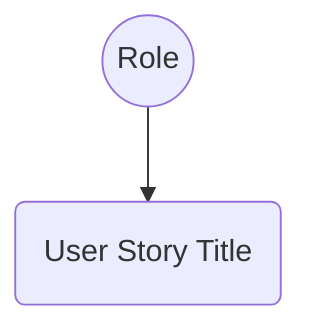

# Analysis Requirement Documentation Skill

This skill allows you to transform detailed requirement documents into an Agile hierarchy suitable for project management and implementation tracking.

## Hierarchy Mapping

| Agile Level    | Source Requirement Element  | ID Format                | Example                                             |
| :------------- | :-------------------------- | :----------------------- | :-------------------------------------------------- |
| **Epic**       | Module (Main H1 or File)    | `EPIC-{XXX}`             | `EPIC-001: Treasury Visibility`                     |
| **User Story** | Section Header (H1 Section) | `US-{XXX}.{YYY}`         | `US-001.001: Wallet Management`                     |
| **Task**       | Functional Requirement (H2) | `TASK-{XXX}.{YYY}.{ZZZ}` | `TASK-001.001.001: Users can manually add a wallet` |

## Transformation Rules

1.  **Parsing Source**: Read files from `./docs/raw-docs/{Project Name}/...`.
2.  **Logical Restructuring & Numbering**:
    - **Reorder**: If the source document flows poorly (e.g., "Settings" before "Login"), REORDER the User Stories logically.
    - **Renumber**: Assign new `US-{XXX}.{YYY}` IDs based on the _logical_ order, not the source order.
    - **Consolidate**: Merge tiny, related sections into one User Story if they are too granular.
    - **Split**: Break down massive "Mega-Stories" into smaller, manageable User Stories.
3.  **Identifying Epics**: Main module = **Epic** (`EPIC-{XXX}`).
4.  **Identifying User Stories**: Logical sections = **User Stories** (`US-{XXX}.{YYY}`).
5.  **Identifying Tasks**: Individual requirements = **Tasks** (`TASK-{XXX}.{YYY}.{ZZZ}`).
    - _Note_: Map old `FR-x.x` codes to the new `TASK` IDs in the description for traceability.
6.  **Capturing Enriched Detail**:
    - **Business Logic & Rationale**: Extract the "Rationale" or general introductory text.
    - **Functional Requirements**: Capture new `TASK ID`, old `FR Code`, `Title`, and summary.
    - **Acceptance Criteria**: Extract from "System Behavior" bullet points.
    - **Edge Cases**: Extract tables or bullet points.
    - **Usability**: Capture "Usability" or "UX" details.
    - **Audit & Compliance**: Capture "Audit/Compliance" notes.
    - **Form Specifications**: Extract detailed form field definitions (see Form Spec section below).
7.  **Generating Use Case Diagrams**: Create Mermaid use case diagrams for the Epic.
8.  **Modeling User Flows**: Create Mermaid sequence/flowcharts for each User Story.

## Form Specification Requirements

For every User Story that involves user input forms, extract and document a **Form Specification** section with:

### Form Field Definition Template

| Field # | Field Name | Label | Type | Required | Auto-fill | Format/Validation | Source (if auto) | Error Message |
|---------|-----------|-------|------|----------|-----------|-------------------|------------------|---------------|
| 1 | `field_name` | Display Label | text/number/select/date/etc | Yes/No | Yes/No | Regex, min/max, pattern | API/State/Context | "Error message text" |

### Field Types

| Type | Description | Examples |
|------|-------------|----------|
| `text` | Single line text | Name, email, title |
| `textarea` | Multi-line text | Description, notes |
| `number` | Numeric input | Amount, quantity |
| `select` | Dropdown selection | Status, category |
| `multi-select` | Multiple selections | Tags, categories |
| `date` | Date picker | Birth date, expiry |
| `datetime` | Date + time | Schedule, deadline |
| `checkbox` | Boolean toggle | Accept terms, enable |
| `radio` | Single choice | Payment method |
| `file` | File upload | Document, image |
| `wallet-address` | EVM wallet address | 0x... format |
| `email` | Email address | user@domain.com |
| `url` | URL | https://... |
| `password` | Password input | Min 8 chars, special chars |

### Validation Rules

| Rule | Description | Example |
|------|-------------|---------|
| `required` | Field must be filled | "This field is required" |
| `minLength` | Minimum character count | minLength: 3 |
| `maxLength` | Maximum character count | maxLength: 100 |
| `pattern` | Regex pattern | pattern: `^0x[a-fA-F0-9]{40}$` |
| `min` | Minimum value (number/date) | min: 0 |
| `max` | Maximum value (number/date) | max: 1000000 |
| `email` | Valid email format | pattern: email regex |
| `url` | Valid URL format | must start with http/https |
| `unique` | Must be unique in system | "This value already exists" |
| `custom` | Custom validation logic | See validation function |

### Auto-fill Sources

| Source Type | Description | Example |
|-------------|-------------|---------|
| `user-profile` | From authenticated user profile | Name, email, avatar |
| `wallet-connected` | From connected wallet | Wallet address, ENS |
| `system-default` | System default value | Default currency, timezone |
| `api-lookup` | Fetched from API | User preferences, settings |
| `url-param` | From URL query parameters | `?workspaceId=xxx` |
| `previous-step` | From previous wizard step | Data carried forward |
| `computed` | Calculated from other fields | Total = sum of line items |
| `browser` | From browser/storage | Language, timezone |

### Example Form Specification

```markdown
## 8. Form Specifications

### Form: OnboardingCapitalForm

**Purpose**: Collect user's initial capital to personalize content
**Submission**: POST /api/v1/onboarding/capital

| Field # | Field Name | Label | Type | Required | Auto-fill | Format/Validation | Source (if auto) | Error Message |
|---------|-----------|-------|------|----------|-----------|-------------------|------------------|---------------|
| 1 | `capital_range` | Số vốn bạn đang có | radio | Yes | No | 0 / <1tr / <10tr / >10tr | — | "Chọn một mốc nhé" |
| 2 | `primary_goal` | Mục tiêu chính | select | No | No | Kiếm tiền/Tiết kiệm/Đầu tư | — | — |
| 3 | `userId` | User ID | uuid | Yes | Yes | Valid UUID format | user-profile | — |
```

## Output Format

When performing an analysis, generate individual Markdown files for each **User Story**, organized within **Epic** subdirectories in the `./docs/requirement/[Project Name]/` directory.

### User Story File Template

````markdown
# User Story: [Section Name]

**ID**: [US-ID]
**Epic**: [Epic Name] ([EPIC-ID])

## 1. Business Logic & Rationale

[Extract general purpose and benefit of this section]

## 2. Use Case Diagram



## 3. User Flow

```mermaid
flowchart LR
    [Sequence or Flowchart]
```

## 4. Functional Requirements (Tasks)

- [ ] **[TASK-ID]**: [Task Title] (Ref: [Old FR-Code])
  - **Priority**: [MoSCoW]
  - **Dependencies**: [List dependent Task IDs or "None"]
  - **Description**: [Summary]
  - **Acceptance Criteria**:
    - [ ] [Criterion 1]

## 5. Edge Cases & Exceptions

| Scenario   | System Behavior | Risk   |
| :--------- | :-------------- | :----- |
| [Scenario] | [Behavior]      | [Risk] |

## 6. Audit & Compliance Notes

[Strategic implications for financial visibility/audit trails]

## 7. Usability & UX Details

[UI behavior, design tokens, or interaction guidance]

## 8. Form Specifications (if applicable)

### Form: [FormName]

**Purpose**: [What this form does]
**Submission**: [API endpoint or action]

| Field # | Field Name | Label | Type | Required | Auto-fill | Format/Validation | Source (if auto) | Error Message |
|---------|-----------|-------|------|----------|-----------|-------------------|------------------|---------------|
| 1 | `field_name` | Display Label | text | Yes/No | Yes/No | validation rules | — | "Error text" |
```

## Workflow Steps

1.  **Scan**: List items in `./docs/raw-docs/`.
2.  **Read**: Process each module.
3.  **Extract**: Identify all sections (Business Logic, FRs, Edge Cases, Audit, Usability, **Form Specifications**).
4.  **Convert**: Map to the enriched template.
5.  **Output**: Write granular Markdown files.

## Integration with other Skills

- **Test Case Documentation**: Use the `TASK` IDs for direct traceability.
- **Technical Design**: Map components to specific `US` and `TASK` IDs.
- **UI/UX Design**: Form specifications inform validation and field behavior.

## Quality Checklist

- [ ] File contains all mandatory sections (including Form Specs if form exists).
- [ ] IDs follow standard format (`US-XXX.YYY`, `TASK-XXX.YYY.ZZZ`).
- [ ] User Stories are logically ordered (not just source order).
- [ ] Old `FR` codes are referenced for traceability.
- [ ] Mermaid diagrams included.
- [ ] Form Specifications complete with all fields defined (type, validation, auto-fill source).
- [ ] Each form field has error message defined (if required).
- [ ] Auto-fill sources clearly documented for each auto-populated field.
