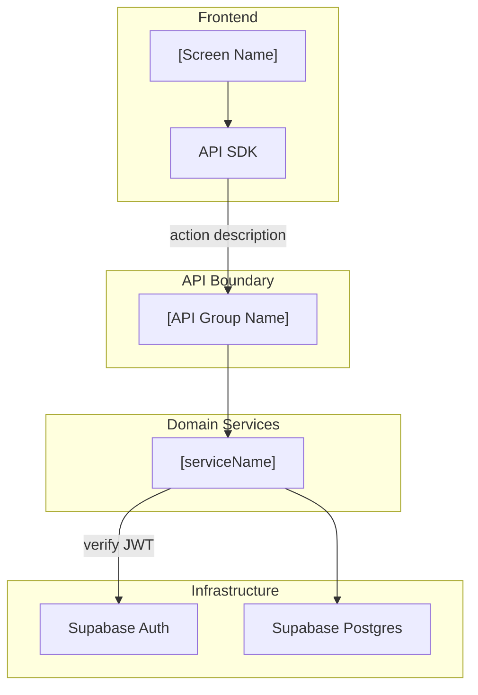

# Architecture Documentation Skill

## When to Use

- **New Epic introduced**: Add a feature-level architecture section to `docs/architecture/system-architecture-overview.md`.
- **New technology added**: Update the architecture diagrams after `research-technology-documentation` has been run.
- **Significant design change**: Amend existing diagrams when a Technical Design conflicts with the current architecture.

---

## Two Levels of Architecture

| Level | Document | Purpose |
|---|---|---|
| **System-level** | `docs/architecture/system-architecture-overview.md` | End-to-end platform overview — all layers connected |
| **Feature-level** | Embedded as Section 2 in `docs/features/[EPIC]/technical-design/[US-ID].md` | Architecture slice scoped to a single User Story |

---

## Step 1 — Pre-flight: Read Context

Read these in order:

1. `docs/features/base-design.md` — Sections 1–5 (confirmed services, tables, routes, events).
2. `docs/techinical-base/README.md` — current tech stack.
3. `docs/architecture/system-architecture-overview.md` — existing diagrams 1, 1.1, 1.2, 1.3.
4. The relevant Requirement file(s) in `docs/requirement/[EPIC]/`.

---

## Step 2 — System-Level Architecture (update only when needed)

File: `docs/architecture/system-architecture-overview.md`

**Trigger**: Only update when:
- A new major component is introduced (new service, new external dependency, new data store).
- An existing component's role changes fundamentally.
- A new Epic introduces a cross-cutting flow not yet shown in diagrams.

**Diagram inventory** (maintain all 4):

| Diagram | Mermaid type | Scope |
|---|---|---|
| Diagram 1 — High-Level | `flowchart TD` | All platform layers (FE, Backend, Supabase, Kafka, ClickHouse, On-chain) |
| Diagram 1.1 — Frontend Detail | `flowchart TD` | Hook layers, state management, API SDK, frontend libraries |
| Diagram 1.2 — Backend Detail | `flowchart TD` | NestJS domain services, async worker, infra connections |
| Diagram 1.3 — Event Streaming | `flowchart LR` | Debezium CDC → Kafka → Connect → ClickHouse |

**Rules**:
- Use `flowchart TD` or `flowchart LR` (not `graph`).
- Add `%% accTitle: [description]` on the first line of every Mermaid block.
- Use `%%{init: ...}%%` only when spacing needs adjustment for readability.
- Subgraph labels use double quotes: `subgraph FE["Frontend"]`.
- Node labels with `(`, `)`, `@`, `<`, `>` must be quoted: `Node["Label (detail)"]`.
- When adding a component, check `base-design.md` Section 8 for existing suggested names — use them if confirmed, or propose new names.

---

## Step 3 — Feature-Level Architecture Slice

Feature-level architecture is **Section 2** of every Technical Design document.
This is written as part of the `technical-design-documentation` skill, not as a standalone document.

When writing Section 2 of a TD:

1. **Identify the components involved** — which services, which data stores, which external integrations.
2. **Draw the slice** — show only the components relevant to this User Story. Reference diagram 1.2 for backend, diagram 1.1 for frontend.
3. **Document component responsibilities** — one paragraph per component in the slice, stating what it owns and what it does not own.

### Feature-Level Diagram Template

---

## Step 4 — Definition of Done

- [ ] All affected diagrams updated with new/changed components.
- [ ] New components have accurate labels and are connected correctly.
- [ ] No orphaned nodes (every node must have at least one edge).
- [ ] `base-design.md` Section 8 (Architecture Assumptions) updated if new suggested names were introduced.
- [ ] Mermaid syntax is valid — no unquoted special characters in labels.
