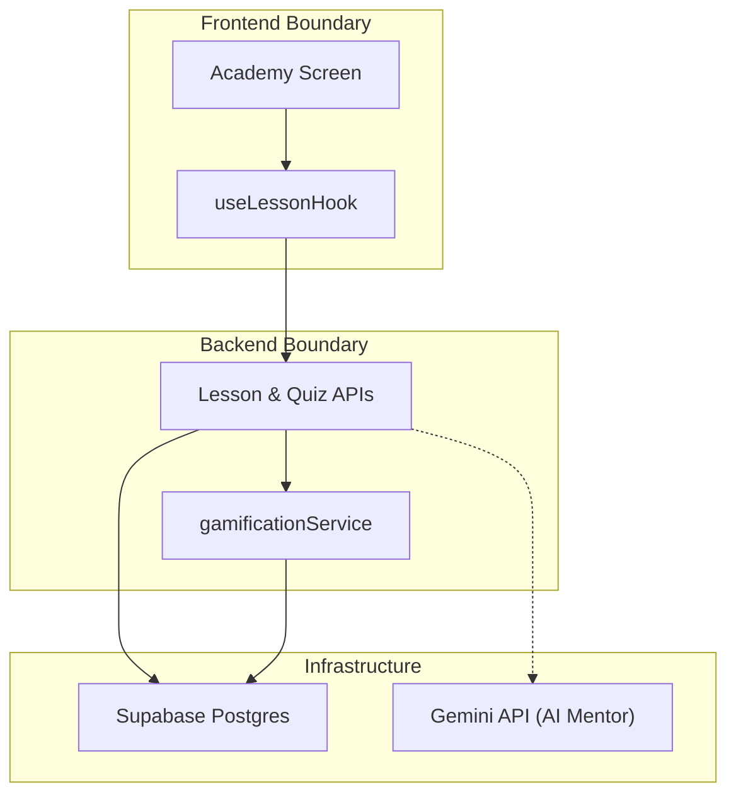
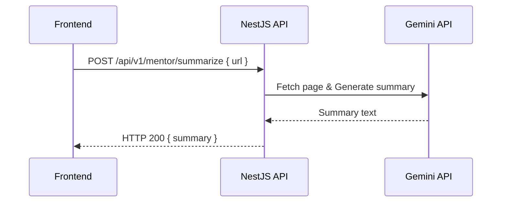
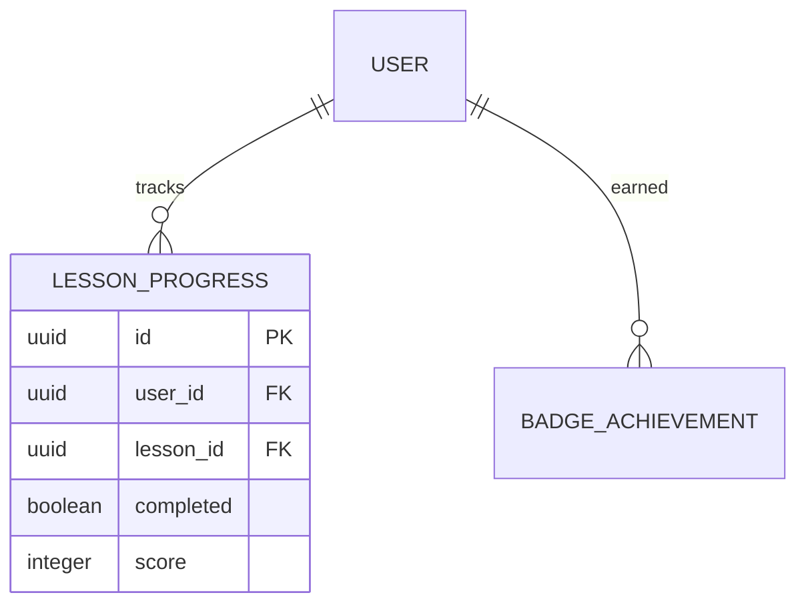

# Technical Design Patterns

Reference patterns, rules, and pitfalls for writing Technical Design documents.
Use this skill when you need to check the correct pattern for a specific concern.

---

## Frontend Design Rules

- Follow diagram 1.1 layering: **Route/Screen → Component → Hook → API SDK → Backend** — no layer skips
- **Smart Components** own data-fetch and dispatch; **Presentational Components** receive props only
- **Hook API** is the only data-fetch boundary — never call `fetch` or Supabase client directly from a component
- **State Manager** (Redux + React Context) is the single state entrypoint
- **Realtime subscriptions** live inside Hook API via `API SDK → Supabase Realtime`; result committed to State Manager only through the hook
- Always specify **loading**, **error**, and **empty** states for every screen

---

## AI & Gamification Design Rules

- **AI Response Handling (Gemini)**:
    - Never block the UI while waiting for AI generation.
    - Use streaming for longer summaries or mentor responses.
    - Always have a fallback for AI failure (e.g., "AI Mentor is resting").
- **Gamification Logic (Leveling/Badges)**:
    - Points and XP must be calculated server-side (NestJS) to avoid client tampering.
    - Badges or levels achieved should be pushed via Supabase Realtime for immediate "Wow" factor.
    - Daily streaks tracking requires a daily unique completion event.

---

## Data Schema Rules

- Every table: `workspace_id uuid NOT NULL REFERENCES workspaces(id)` + RLS policy documented
- Every table: `created_at`, `updated_at` timestamps + `deleted_at` for soft delete on auditable entities
- Define all indexes — especially composite indexes for multi-tenant queries `(workspace_id, status)`
- Write ops through NestJS (service role); read-only non-sensitive ops may use PostgREST (session JWT + RLS)
- Every TD must include explicit RLS policy expressions (`USING` / `WITH CHECK`) for `authenticated` and state whether client writes are disabled
- Default stance: no direct `INSERT/UPDATE/DELETE` for `authenticated` unless explicitly justified by requirement and risk review

---

## Mermaid Diagram Patterns

### Architecture Slice

### Sequence — AI Interaction

### ERD

**Diagram rules:**
- Use meaningful labels (not A, B, C)
- Use `%%` comments for complex logic
- Use subgraphs for logical grouping
- Slice only the relevant components — do not redraw the full system

---

## Common Pitfalls

1. Redrawing the full system architecture instead of slicing the relevant part
2. Missing RLS policy documentation on new tables
3. Routing AI or OCR logic to Supabase PostgREST — must use NestJS
4. Missing logic for XP/Badge calculation in gamification features
5. Using single-letter diagram labels
6. Not checking `base-design.md` before designing a dependent feature
7. Not filling Section 4.0 API Routing Table — routing must be explicit
8. Missing Section 5 (Frontend Design) — TD must be end-to-end FE + BE
9. Calling API SDK directly from a component — all data-fetch through a Hook
10. Assuming business metrics (XP, points) can be managed client-side
11. Not specifying loading / error / empty states for screens
