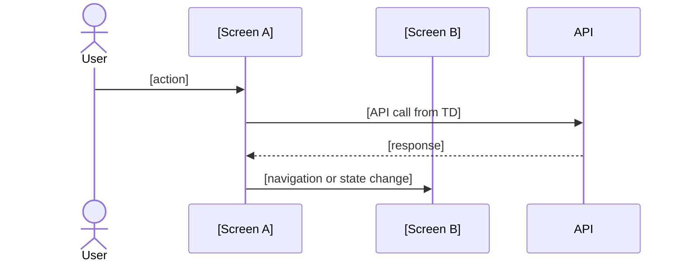

# UI Design Documentation Skill

## Scope

This skill produces a **feature-level UI/UX spec** for one User Story.
It does NOT document a global design system (colors, fonts, tokens) — those are fixed (shadcn/ui + Tailwind).

One UI doc per User Story, covering:
- Screen inventory and layout
- Component breakdown (using `@workspace/ui` + shadcn primitives)
- State transitions and user flows
- Data bindings (what renders where)
- Empty/loading/error states
- Realtime update behavior (if applicable)

## Output

- `docs/features/[EPIC]/[US-ID]-ui.md`
- **Interactive Prototype**: `docs/features/[EPIC]/prototypes/[US-ID]-prototype.tsx`

---

## Step 1 — Pre-flight: Read Context

Read in order before writing:

1. **`docs/requirement/[EPIC]/[US-ID] - *.md`** — the user story being designed.
2. **`docs/features/[EPIC]/technical-design/[US-ID].md`** — the Technical Design for this US.
   - Read Section 4 (API routes) to know what data is available.
   - Read Section 6 (Data models) to know data shapes.
   - Read Section 7 (Realtime) to know what pushes to the UI.
3. **`docs/architecture/system-architecture-overview.md`** — diagram 1.1 (Frontend Detailed Architecture).

Map before writing:
- Which **screens** does this US introduce or modify?
- Which **API SDK calls** does each screen need? (from TD Section 4)
- Does any screen need **Supabase Realtime** subscription?
- Are there **role/permission guards** on any screen or action? (from TD Section 10)

### Additional Context
- Coordinate with Technical Design (Step 5a) on API contracts
- Ensure UI data bindings match TD Section 6 data shapes
- Plan Interactive Prototype with mock data for designer testing

---

## Step 2 — File Location

```
docs/features/
├── [EPIC folder]/
│   ├── [US-ID]-ui.md       ← documentation file
│   └── prototypes/
│       └── [US-ID]-prototype.tsx    ← Interactive Prototype
```

**Rules:**
- Path: `docs/features/[EPIC folder]/[US-ID]-ui.md`
- EPIC folder mirrors `docs/requirement/` exactly.
- File name: `[US-ID]-ui.md` — e.g., `US-003.001-ui.md`.
- Prototype at `[EPIC]/prototypes/[US-ID]-prototype.tsx`

---

## Step 2A — Interactive Prototype

Create an Interactive Prototype that designers can test directly:

**Prototype requirements:**
- Component runs standalone with mock data
- Supports all user interactions (clicks, form inputs, navigation simulation)
- Demonstrates state transitions (loading → success, loading → error)
- Shows empty states and edge cases
- Uses same component structure as production code

**Example structure:**
```typescript
// [US-ID]-prototype.tsx
'use client'

interface MockData {
  // Mock data matching TD Section 6 schemas
}

const mockData: MockData = {
  // ... sample data
}

export function [ComponentName]Prototype() {
  const [state, setState] = useState<'idle' | 'loading' | 'success' | 'error'>('idle')

  // Simulate API calls with delays
  const handleAction = async () => {
    setState('loading')
    await new Promise(r => setTimeout(r, 500)) // Simulate network delay
    // ... action logic
  }

  return (
    // Render with mock data
  )
}
```

**Prototype testing scenarios:**
- Click through user flows
- Test form validation
- Verify error handling
- Check responsive behavior
- Demonstrate realtime updates (if applicable)

---

## Step 3 — Document Template

```markdown
# UI/UX Design: [US Title] — [US-ID]

> **Requirements**: [US-ID] — [link to requirement file]
> **Technical Design**: [link to TD file]
> **Status**: Draft | Review | Approved

---

## 1. Screen Inventory

List all screens (pages/routes) introduced or modified by this US.

| Screen | Route | Access Control | Description |
|---|---|---|---|
| [Screen Name] | `/[route]` | [role required] | [1-line description] |

---

## 2. User Flow



---

## 3. Screen Specs

### Screen: [Screen Name]

**Route**: `/[route]`
**Component file**: `apps/daily-tips/app/[route]/page.tsx`

#### Layout

```
[ASCII or prose layout description]
Example:
+-------------------------------------+
| [PageHeader] title + action button  |
+---------------+---------------------+
| [FilterBar]   |                     |
+---------------+  [DataTable]        |
|               |                     |
+---------------+---------------------+
```

#### Component Breakdown

| Component | Source | Props / Data |
|---|---|---|
| `[ComponentName]` | `@workspace/ui` or `components/` | `[prop: type]` |

#### Data Bindings

| UI Element | Data Source | API Call | Notes |
|---|---|---|---|
| [Element] | `useXxxApi().data.[field]` | `GET /api/v1/[route]` | |

#### States

**Loading:** [Describe skeleton or spinner behavior]

**Empty:** [Describe empty state — what message, what CTA]

**Error:** [Describe error state — inline or toast, retry option]

**Realtime updates** (if applicable): [Describe what changes when a Supabase Realtime event arrives]

#### Actions

| Action | Trigger | Behavior | API Call |
|---|---|---|---|
| [Action name] | [Button click / form submit] | [What happens in UI] | `[METHOD /route]` |

#### Validation

| Field | Rules | Error message |
|---|---|---|
| [field] | [required, min, format] | "[message]" |

#### Access Control

| Element / Action | Required Role | Behavior if unauthorized |
|---|---|---|
| [element] | [role] | Hidden / Disabled / Redirect |

---

## 4. Reusable Components

List any new components that should go into `packages/ui/`:

| Component | Proposed name | Props | Notes |
|---|---|---|---|
| [description] | `[ComponentName]` | `[props]` | [reuse rationale] |

---

## 5. Open Questions

- [ ] [Design decision pending]
```

---

## Step 4 — Sync Requirement

Before this doc is marked **Approved**, verify against the Technical Design:

- [ ] Every API call in data bindings exists in TD Section 4.
- [ ] Every data field used in the UI exists in TD Section 6 (data models).
- [ ] Realtime events shown in the UI match TD Section 7.
- [ ] Permission/role guards match TD Section 10.
- [ ] No screen shows data that the TD does not expose.

If any mismatch is found, update the TD first (raise as Open Item), then update this doc.

---

## Step 5 — Definition of Done

- [ ] All screens introduced by this US are documented.
- [ ] Every screen has: layout, component breakdown, data bindings, states, actions.
- [ ] User flow diagram covers happy path + main error path.
- [ ] File saved to correct path: `docs/features/[EPIC]/[US-ID]-ui.md`.
- [ ] Backlink to requirement and TD are at the top of the document.
- [ ] Synced with Technical Design (no conflicts).
- [ ] Interactive Prototype created at `docs/features/[EPIC]/prototypes/[US-ID]-prototype.tsx`.
- [ ] Prototype includes mock data matching TD Section 6 schemas.
- [ ] Prototype supports all user interactions from user flow.
- [ ] Prototype demonstrates loading, success, error states.
- [ ] Designer has tested and validated UX flow.

---

## Quick Checklist

- [ ] Requirement and TD read
- [ ] All screens documented with layout, components, data bindings
- [ ] User flow diagram complete
- [ ] States documented (loading, empty, error)
- [ ] Actions and validation documented
- [ ] Access control documented
- [ ] Synced with TD (no conflicts)
- [ ] Interactive Prototype created
- [ ] Mock data matches TD Section 6 schemas
- [ ] All user flows testable in prototype
- [ ] Designer tested and approved UX
