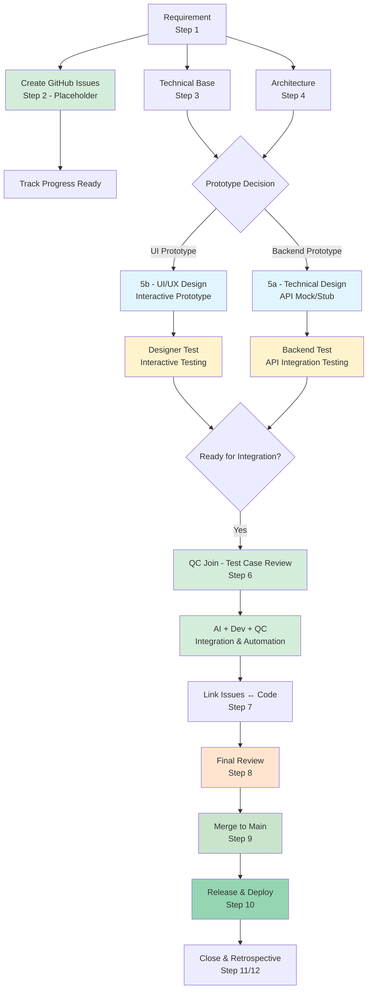

# New Feature Workflow

Use this workflow when the user provides a new requirement or a new User Story to be added to the platform.

---

## Overview: Integrated Product Development (12 Steps)

```
Step 1:  Normalize Requirement
Step 2:  Create GitHub Issues (placeholder for tracking)
Step 3:  (if new tech) Research Technology
Step 4:  (if arch change) Update Architecture
Step 5a: Technical Design + API Mock/Stub ──┐
Step 5b: UI/UX Design + Interactive Prototype ──┼── Sync check
Step 6:  Test Cases + Automation Prep (QC Join) ┘
Step 7:  AI + Dev + QC Integration
Step 8:  Link Issues ↔ Code (Traceability)
Step 9:  Final Review (Pre-Merge)
Step 10: Merge to Main + CI/CD
Step 11: Release & Deploy
Step 12: Close Issues & Retrospective
```

---

## Workflow Diagram



---

## Step 1 — Normalize Requirement

**Skill**: `.agent/skills/analysis-requirement-documentation/SKILL.md`

**Input**: Raw requirement text, Notion page, or user description.

**Output**:
- `docs/requirement/[EPIC folder]/README.md` (Epic index)
- `docs/requirement/[EPIC folder]/[US-ID] - [Name].md` (User Story file)

**Gate**: Do not proceed until user confirms the requirement document is accurate.

---

## Step 2 — Create GitHub Issues (Placeholder)

**Skill**: `.agent/skills/create-github-issues/SKILL.md`

**When to run**: Ngay sau khi Step 1 hoàn thành — requirement đã được chuẩn hóa và danh sách User Stories rõ ràng.

**Output**:
- GitHub Issues trong `Daily-Tips-Backend` và `Daily-Tips-Frontend` repos
- Issues được tag theo EPIC và User Story ID
- Traceability table khởi tạo: `Requirement → Issue`

**Note**: Issues lúc này ở trạng thái **placeholder** — chưa có implementation details. Dùng để track progress và assign resources sớm. Khi Steps 5a/5b/6/7 hoàn thành, update issues với spec chi tiết.

**Gate**: User xác nhận danh sách issues trước khi tạo.

---

## Step 3 — Research Technology (conditional)

**Skill**: `.agent/skills/research-technology-documentation/SKILL.md`

**When to run**: Only if the feature introduces a technology not yet documented in `docs/techinical-base/`.

**How to check**: Read `docs/techinical-base/README.md` — if the technology is already listed and has a folder, skip this step.

**Output**: `docs/techinical-base/[tech-name]/README.md`

---

## Step 4 — Update Architecture (conditional)

**Skill**: `.agent/skills/architecture-documentation/SKILL.md`

**When to run**: Only if the feature introduces a new component, a new cross-cutting flow, or significantly changes an existing service boundary.

**How to check**: Read `docs/architecture/system-architecture-overview.md` diagrams 1–1.3. If all involved components are already present and correctly connected, skip this step.

**Output**: Updated `docs/architecture/system-architecture-overview.md`

**Gate**: Do not proceed until architecture is stable.

---

## Step 5a — Technical Design + API Mock/Stub

**Skill**: `.agent/skills/technical-design/SKILL.md`

**Input**: Requirement doc from Step 1 + architecture from Step 4.

**Output**:
- `docs/features/[EPIC folder]/technical-design/[US-ID].md`
- **API Mock/Stub**: `docs/features/[EPIC folder]/mocks/[US-ID]-mock.ts`

**Must complete**:
- [ ] All 15 sections written
- [ ] `base-design.md` updated (Sections 1–5, 8, 9)
- [ ] No unresolved conflicts with existing registry entries
- [ ] API Mock/Stub implemented for parallel testing

**API Mock/Stub requirements**:
- Implement all endpoints from TD Section 4
- Return mock data matching TD Section 6 schemas
- Include realistic delays (100-500ms simulation)
- Support all HTTP methods (GET, POST, PUT, DELETE)
- Include error scenarios (400, 401, 403, 404, 500)

---

## Step 5b — UI/UX Design + Interactive Prototype

**Skill**: `.agent/skills/ui-design-documentation/SKILL.md`

**Input**: Requirement doc from Step 1 + Technical Design from Step 5a (for API contracts and data shapes).

**Output**:
- `docs/features/[EPIC folder]/[US-ID]-ui.md`
- **Interactive Prototype**: `docs/features/[EPIC folder]/prototypes/[US-ID]-prototype.tsx`

**Must complete**:
- [ ] All screens documented (layout, components, data bindings, states, actions)
- [ ] User flow diagram covers happy path + main error path
- [ ] Interactive Prototype ready for designer testing

**Interactive Prototype requirements**:
- Component runs standalone with mock data
- Supports all user interactions (clicks, form inputs, navigation simulation)
- Demonstrates state transitions (loading → success, loading → error)
- Shows empty states and edge cases

---

## Sync Check (between 5a and 5b)

Before proceeding to Step 6, verify:

| Check | Verified by |
|---|---|
| Every API call in UI data bindings exists in TD Section 4 | Cross-check 5a ↔ 5b |
| Every data field in UI exists in TD Section 6 data models | Cross-check 5a ↔ 5b |
| Realtime events in UI match TD Section 7 | Cross-check 5a ↔ 5b |
| Permission guards in UI match TD Section 10 | Cross-check 5a ↔ 5b |

If any mismatch: update the TD first, then update the UI doc. Re-run sync check.

---

## Step 6 — Test Cases + Automation Prep

**Skill**: `.agent/skills/test-case-documentation/SKILL.md`

**Prerequisite**: Both Step 5a and Step 5b are complete and synced.

**Output**: `docs/features/[EPIC folder]/[US-ID]-test.md`

**QC responsibilities**:
- Review Test Cases cùng AI
- Xác định edge cases từ business perspective
- Build automation test scripts
- Prepare test data sets

**Must complete**:
- [ ] Every acceptance criterion has at least one test case
- [ ] Every error path from TD has a negative test case
- [ ] Every role boundary has a permission test case
- [ ] Every workspace-scoped resource has an isolation test case
- [ ] Automation test scripts khởi tạo

---

## Step 7 — AI + Dev + QC Integration

**Activities**:

| Role | Responsibilities |
|---|---|
| **AI** | Generate code from TD + UI Design, API clients from OpenAPI spec, test implementations |
| **Dev (Backend)** | Review AI-generated backend code, implement complex logic, database migrations |
| **Dev (Frontend)** | Review AI-generated components, implement complex interactions, connect real APIs |
| **QC** | Run automation tests, verify coverage, report bugs, validate acceptance criteria |

**Integration Process**:
```
1. Replace mock API with real API calls
2. Connect frontend → backend
3. Run automation test suite
4. Fix failures (AI + Dev + QC collaboration)
5. Re-run tests until stable
```

**Output**: Working implementation ready for review.

---

## Step 8 — Link Issues ↔ Code (Traceability)

**Skill**: `.agent/skills/create-github-issues/SKILL.md`

**Prerequisite**: Steps 5a, 5b, 6, 7 complete.

**Output**:
- GitHub Issues updated with implementation details
- Complete traceability table: `Requirement → TD → UI → Test → Issue → Code`
- Issues linked to PRs and commits

---

## Step 9 — Final Review (Pre-Merge)

**Purpose**: Ensure code is ready for merge to main branch.

**Activities**:

| Role | Responsibilities |
|---|---|
| **AI** | Run final lint/typecheck, verify all tests pass, check coverage |
| **Dev (Backend)** | Code review PR, verify API contracts match TD, check migrations |
| **Dev (Frontend)** | Code review PR, verify UI matches design, check performance |
| **QC** | Run full regression suite, verify acceptance criteria, sign-off |

**Checklist**:
```
[ ] All tests pass (unit, integration, e2e)
[ ] Code coverage ≥ 80%
[ ] Lint and typecheck pass
[ ] Performance tests pass (Lighthouse, bundle size)
[ ] Security scan shows no vulnerabilities
[ ] API contract tests pass
[ ] UX/UI review passed (Designer sign-off)
[ ] Documentation updated (README, API docs)
[ ] Changelog updated
```

**Gate**: All checklist items must be complete before merge.

---

## Step 10 — Merge to Main + CI/CD

**Purpose**: Merge code to main branch and trigger CI/CD pipeline.

**Activities**:
```bash
git checkout main
git pull origin main
git merge --squash feature/[US-ID]-[feature-name]
git commit -m "feat: implement [US-ID] - [feature name]"
git push origin main
```

**CI/CD Pipeline**:
```
1. Install dependencies
2. Run linter & typecheck
3. Run unit tests + coverage
4. Run integration tests
5. Run e2e tests (Playwright/Cypress)
6. Build production bundle
7. Security scan (npm audit, SAST)
8. Deploy to staging environment
```

**Output**:
- Code merged to main
- CI/CD pipeline passed
- Staging environment deployed
- Release notes auto-generated

**Gate**: CI/CD pipeline must pass completely.

---

## Step 11 — Release & Deploy

**Purpose**: Deploy to production and monitor.

**Activities**:

| Phase | Description | Owner |
|---|---|---|
| **Staging Verification** | Test on staging with production-like data | QC + Dev |
| **Production Deploy** | Deploy from main to production | DevOps / Lead |
| **Smoke Tests** | Quick verification tests on production | QC |
| **Monitor & Alert** | Monitor metrics, logs, errors (24h) | Dev + Ops |

**Production Deploy Checklist**:
```
[ ] Staging tests passed (100% pass rate)
[ ] Database migrations tested on staging
[ ] Rollback plan prepared
[ ] Feature flags configured (if applicable)
[ ] Monitoring dashboards ready
[ ] Alert rules configured
[ ] Stakeholders notified
[ ] Release notes published
```

**Post-Release (First 24 Hours)**:
- Monitor error rates (Sentry, LogRocket)
- Track performance metrics (LCP, FID, CLS)
- Watch user feedback (support tickets, Slack)
- Verify business metrics (conversion, usage)
- Standby for hotfixes if needed

**Output**:
- Feature live on production
- Release notes published
- Monitoring active
- Post-release report (after 24h)

---

## Step 12 — Close Issues & Retrospective

**Purpose**: Close GitHub Issues and capture lessons learned.

**Activities**:
- Close all related GitHub Issues
- Update status: `Done` or `Released`
- Link to release tag/version
- Retrospective meeting (for major features)

**Retrospective Template**:
```markdown
## Retrospective - [US-ID] [Feature Name]

### What went well
-

### What could be improved
-

### Action items for next iteration
-
```

**Output**:
- All issues closed with release link
- Retrospective notes documented
- Lessons learned added to team playbook

---

## Checklist Summary

```
[ ] Step 1 — Requirement doc created, user confirmed
[ ] Step 2 — GitHub Issues (placeholder) created, user confirmed
[ ] Step 3 — Tech research done (or skipped)
[ ] Step 4 — Architecture updated (or skipped)
[ ] Step 5b — UI/UX Design + Interactive Prototype ready
[ ] Step 5a — Technical Design + API Mock/Stub ready
[ ] Sync — 5a and 5b cross-checked, no conflicts
[ ] Step 6 — Test cases + Automation test scripts ready (QC reviewed)
[ ] Step 7 — AI + Dev + QC integration complete
[ ] Step 8 — GitHub Issues updated with code links, traceability delivered
[ ] Step 9 — Final Review complete, all checks passed
[ ] Step 10 — Merged to main, CI/CD pipeline passed
[ ] Step 11 — Released to production, monitoring active
[ ] Step 12 — Issues closed, retrospective complete
```

---

## Role Responsibilities

| Role | Responsibilities |
|---|---|
| **Designer** | Step 5b: Create UI/UX Design + Prototype, Test Interactive Prototype, Validate UX flows, Step 9: Final UI/UX review sign-off |
| **Backend Dev** | Step 5a: Review Technical Design, Step 7: Review AI code + implement complex logic + API integration, Step 9: Code review + API contract verification, Step 10-11: Production deploy support |
| **Frontend Dev** | Step 5b: Review Interactive Prototype, Step 7: Connect real APIs + optimize performance, Step 9: Code review + performance check, Step 10-11: Production deploy support |
| **QC** | Step 2: Review GitHub Issues (test coverage), Step 6: Review Test Cases + build automation tests, Step 7: Run tests + report bugs, Step 9: Final regression testing + sign-off, Step 11: Smoke tests on production |
| **AI** | Generate documentation (Steps 1-6), Generate code from specs (Step 7), Generate tests from Test Cases, Link code ↔ issues (Step 8), Assist with code review checks (Step 9) |
| **DevOps / Lead** | Step 10: Manage CI/CD pipeline, Step 11: Production deployment, Monitor post-release metrics |

---

## Related Documentation

- **Product Development Workflow**: `docs/product-development-workflow.md`
- **Skills**:
  - `.agent/skills/analysis-requirement-documentation/SKILL.md`
  - `.agent/skills/research-technology-documentation/SKILL.md`
  - `.agent/skills/architecture-documentation/SKILL.md`
  - `.agent/skills/technical-design/SKILL.md`
  - `.agent/skills/ui-design-documentation/SKILL.md`
  - `.agent/skills/test-case-documentation/SKILL.md`
  - `.agent/skills/create-github-issues/SKILL.md`
