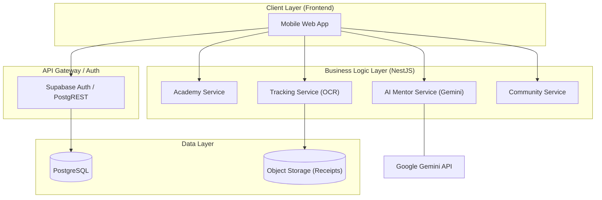

# System Architecture: Daily Tips Platform

This document describes the high-level architecture of the `github-project-playground` platform.

## 1. Technology Stack

- **Frontend**: Mobile-first Web App (React/Vite)
- **Backend**: NestJS (Microservices/Modular Monolith)
- **Database**: Supabase (Postgres + PostgREST + Auth)
- **AI Engine**: Google Gemini API (via AI Mentor Service)
- **OCR Engine**: Tesseract.js / MLKit
- **Infra/Events**: Supabase Realtime / Edge Functions

## 2. High-Level Component Diagram

## 3. Communication Patterns

1.  **Read Operations**: Frontend directly queries Supabase via **PostgREST** for low latency and simplicity (Simple CRUD, Academy Lessons).
2.  **Command/Complex Operations**: Frontend calls **NestJS API** for business logic, external integrations (Gemini, OCR), and atomic transactions (Completing lessons, processing bills).
3.  **Async/Realtime**: Use **Supabase Realtime** for push updates (Leaderboards, Alerts) and **Edge Functions** for lightweight background tasks.

## 4. Security Principles

- **Row Level Security (RLS)**: Enforced at the database level to ensure user data isolation.
- **JWT Auth**: Managed by Supabase Auth.
- **Biometrics**: Local authentication handling on the frontend.
- **Input Validation**: Strict schema validation on all NestJS endpoints.
