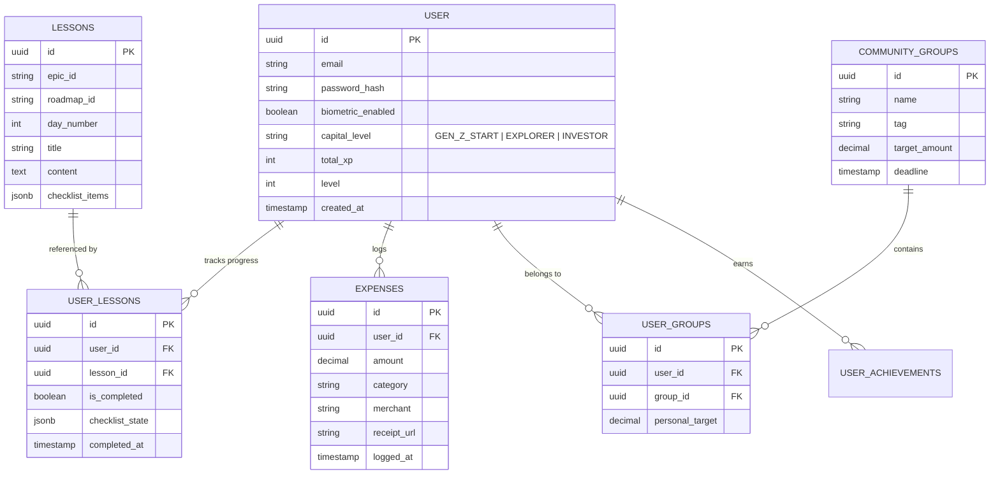

# Database Design: Global ERD

This document visualizes the data relationships across all modules of the platform.

## 1. Entity Relationship Diagram (ERD)

## 2. Core Conventions

- **Primary Keys**: Always `uuid` with `gen_random_uuid()` default.
- **Audit**: All tables include `created_at` and `updated_at`.
- **Soft Delete**: Critical tables (Expenses, Groups) include `deleted_at`.
- **Privacy**: `user_id` is mandatory for all user-scoped data to facilitate RLS.

## 3. Indexing Strategy

- **B-Tree**: On all Foreign Keys (`user_id`, `lesson_id`).
- **GIN**: On `lessons.checklist_items` and `user_lessons.checklist_state` for JSON search if needed.
- **Compound**: `(user_id, logged_at)` on `expenses` for efficient history fetching.
