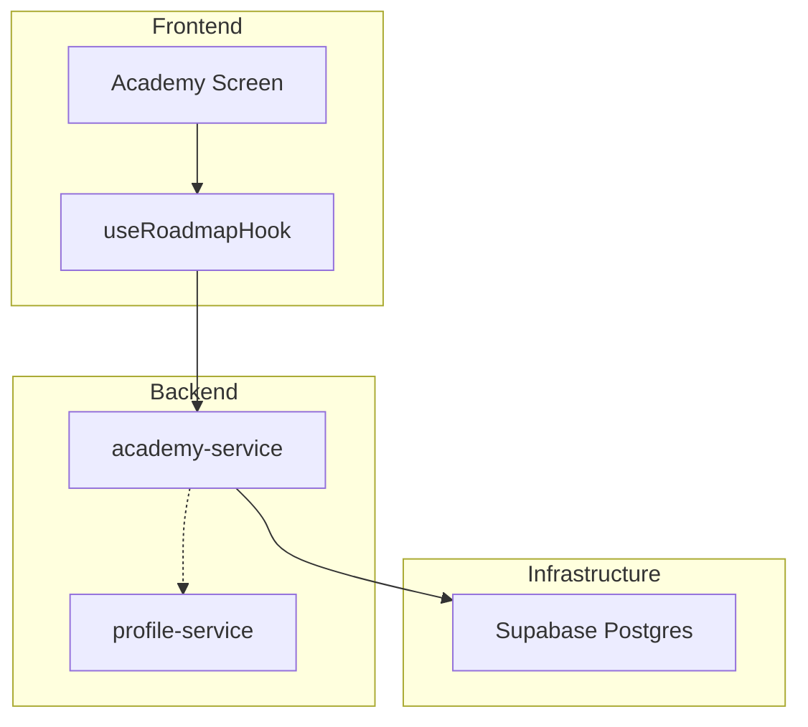

# Technical Design: Affiliate Marketing Roadmap — US-001.001

> **Requirements**: [US-001.001](../../../requirement/EPIC-001%20-%20Academy/US-001.001%20-%20Affiliate%20Marketing%20Roadmap.md)

---

## 1. System Context & Slice

This feature implementation involves:
- **Academy Service**: Providing lesson content and roadmaps.
- **Profile Service**: Tracking user progress and XP.
- **Frontend**: Card-based UI for lesson consumption and progress tracking.



## 2. User Journey Logic

1.  User enters Academy and selects "Affiliate Roadmap".
2.  Frontend fetches roadmap data and user progress.
3.  User reads lesson and interacts with checkboxes.
4.  User marks lesson as complete.
5.  Backend updates progress and awards XP via `profile-service`.

## 3. Data Models & Schema

### 3.1 Academy Tables

#### `lessons`
| Column | Type | Description |
|---|---|---|
| `id` | uuid | Primary Key |
| `epic_id` | text | `EPIC-001` |
| `roadmap_id` | text | `affiliate-7-day` |
| `day_number` | integer | 1-7 |
| `title` | text | Lesson title |
| `content` | text | Markdown content (max 200 words) |
| `checklist_items` | jsonb | Array of tasks: `{ id, text }` |
| `created_at` | timestamptz | |

#### `user_lessons`
| Column | Type | Description |
|---|---|---|
| `id` | uuid | Primary Key |
| `user_id` | uuid | FK to `auth.users` |
| `lesson_id` | uuid | FK to `lessons` |
| `is_completed` | boolean | Default false |
| `checklist_state` | jsonb | `{ task_id: boolean }` |
| `completed_at` | timestamptz | |

### 3.2 RLS Policies

```sql
-- lessons: Read access for all authenticated users
CREATE POLICY "Lessons are viewable by all users" ON lessons
  FOR SELECT TO authenticated USING (true);

-- user_lessons: Users can only see/edit their own progress
CREATE POLICY "Users can manage their own progress" ON user_lessons
  FOR ALL TO authenticated USING (auth.uid() = user_id);
```

## 4. API Design

### 4.0 API Routing Table

| Operation | Method | Path | Routes to | Reason |
|---|---|---|---|---|
| Get Roadmap | GET | `/rest/v1/lessons?roadmap_id=eq.affiliate-7-day` | Supabase PostgREST | Simple read with filter |
| Get Progress | GET | `/rest/v1/user_lessons` | Supabase PostgREST | User-specific read, RLS enforced |
| Update Progress | POST | `/api/v1/academy/complete` | NestJS | Side effects: logic + XP award |

### 4.1 Endpoints (NestJS)

#### `POST /api/v1/academy/complete`
- **Purpose**: Mark a lesson as complete and trigger rewards.
- **Request**:
  ```json
  {
    "lesson_id": "uuid",
    "checklist_state": { "task_1": true, "task_2": true }
  }
  ```
- **Response**: `200 OK` with XP gained.

## 5. Frontend Design

### 5.1 Layering
- **Screen**: `AcademyRoadmapScreen.tsx`
- **Hook**: `useAcademyRoadmap()`
- **Components**: `LessonCard`, `ProgressTracker`, `Checklist`.

### 5.2 State Management
- `academySlice`: Local state for current lesson and temporary checklist changes before sync.

## 6. Realtime & Events

- **Supabase Realtime**: Listen to `user_lessons` for cross-device progress sync.
- **Event**: `lesson.completed` published via `academy-service` to award levels.

## 7. Security & Privacy
- Standard RLS (Row Level Security) prevents users from accessing others' progress.
- API inputs for `checklist_state` must be validated against the `lessons.checklist_items` schema.

## 8. Error Handling
| Code | Scenario | Message |
|---|---|---|
| 404 | Lesson not found | "Bài học không tồn tại." |
| 400 | Invalid checklist state | "Checklist không hợp lệ." |
| 500 | XP update failed | "Hệ thống đang bận, vui lòng thử lại sau." |
