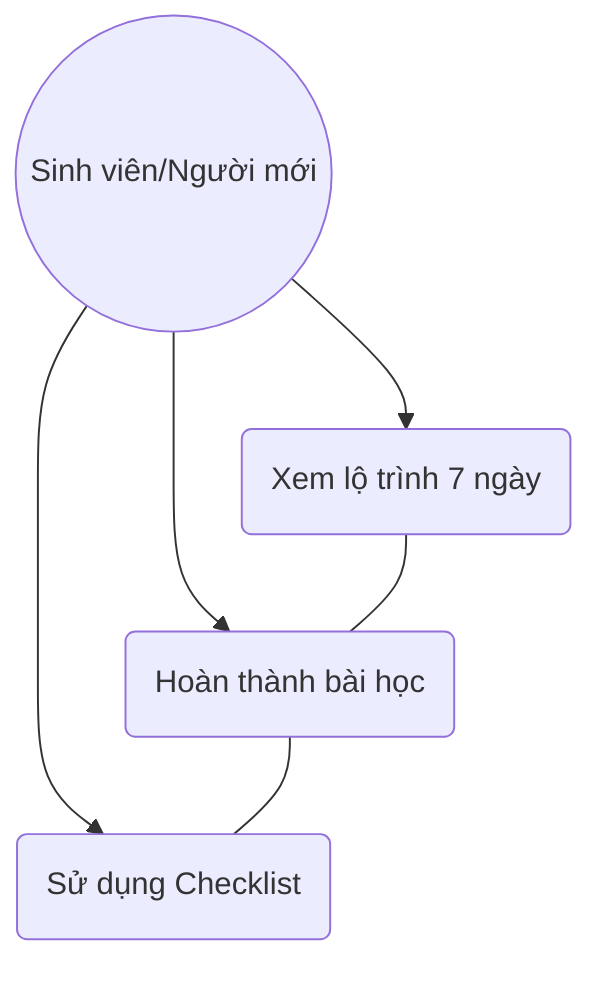
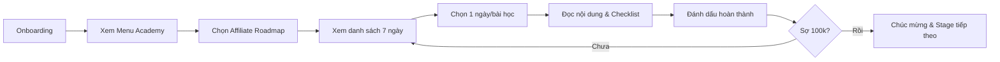

# User Story: Affiliate Marketing Roadmap

**ID**: US-001.001
**Epic**: Academy (EPIC-001)

## 1. Business Logic & Rationale

Gen Z students often look for ways to earn extra income without capital. Affiliate marketing is a high-potential entry point, but it can be overwhelming for beginners. This 7-day roadmap simplifies the process into small, actionable steps ("Micro-learning") to help them reach their first 100,000 VND milestone, building confidence and engagement with the platform.

## 2. Use Case Diagram

## 3. User Flow

## 4. Functional Requirements (Tasks)

- [ ] **TASK-001.001.001**: Soạn nội dung 7 bài học ngắn (Ref: BA-EPIC1.US1.T1)
  - **Priority**: Must-have
  - **Dependencies**: None
  - **Description**: Viết nội dung cho 7 ngày học về Affiliate (Tìm ngách, Tạo nội dung, Kéo traffic, Đặt link...).
  - **Acceptance Criteria**:
    - [ ] Nội dung mỗi ngày không quá 200 từ (Micro-learning).
    - [ ] Mỗi bài học có ít nhất 1 bước thực hành.

- [ ] **TASK-001.001.002**: Thiết kế Checklist hoàn thành bài học (Ref: BA-EPIC1.US1.T2)
  - **Priority**: Must-have
  - **Dependencies**: TASK-001.001.001
  - **Description**: Tạo thành phần UI Checklist cho từng bài học để User theo dõi tiến độ.
  - **Acceptance Criteria**:
    - [ ] Hiển thị dưới dạng các ô checkbox.
    - [ ] Có hiệu ứng gạch ngang khi hoàn thành.

- [ ] **TASK-001.001.003**: Code tính năng "Đánh dấu đã học" (Ref: BA-EPIC1.US1.T3)
  - **Priority**: Must-have
  - **Dependencies**: TASK-001.001.002
  - **Description**: Lưu trạng thái hoàn thành bài học vào Local Storage hoặc Database (tùy phase).
  - **Acceptance Criteria**:
    - [ ] Trạng thái được lưu lại khi User quay lại App.
    - [ ] Hiển thị thanh tiến độ (Progress bar) tổng quan của lộ trình 7 ngày.

## 5. Edge Cases & Exceptions

| Scenario | System Behavior | Risk |
| :------- | :-------------- | :--- |
| User đánh dấu hoàn thành hết 7 ngày trong 1 ngày | Hệ thống vẫn cho phép nhưng hiển thị cảnh báo "Học chậm để hiểu sâu nhé" | Thấp |
| Chưa hoàn thành bài học cũ nhưng muốn xem bài học mới | Cho phép truy cập (Non-linear learning) | Thấp |

## 6. Audit & Compliance Notes

Nội dung Affiliate phải bao gồm cảnh báo về các link lừa đảo hoặc cam kết lợi nhuận quá cao.

## 7. Usability & UX Details

- Sử dụng tone giọng Gen Z (Gần gũi, hài hước).
- Giao diện dạng thẻ (Card-based) dễ vuốt chạm trên mobile.
- Micro-interactions: Rung nhẹ khi check vào ô hoàn thành.
