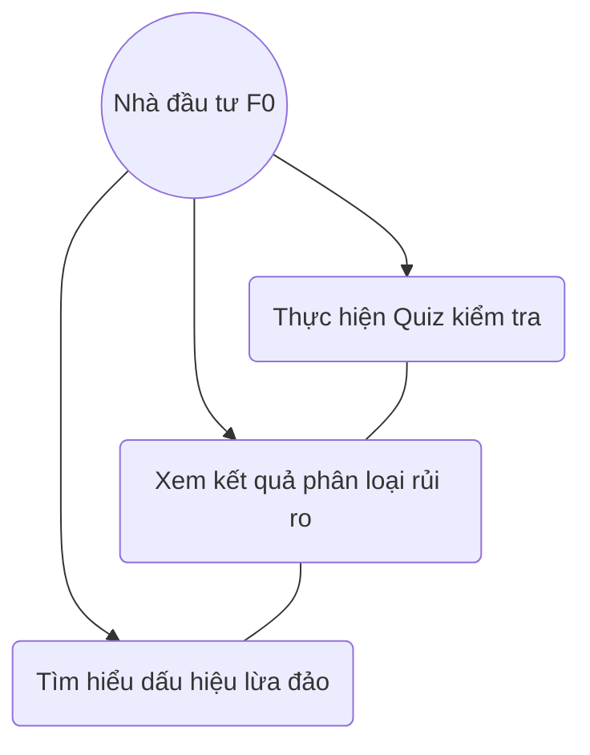
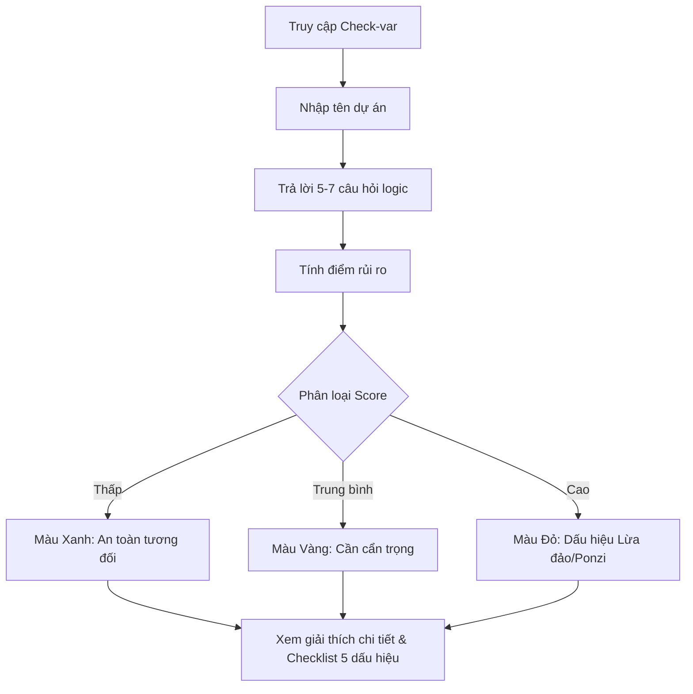

# User Story: Check-var Scam Audit

**ID**: US-001.002
**Epic**: Academy (EPIC-001)

## 1. Business Logic & Rationale

New investors (F0) are primary targets for sophisticated financial scams and Ponzi schemes promising unrealistic returns (e.g., 30% monthly). This "Check-var" tool provides a logical framework (Quiz-based) to systematically audit a project against known red flags, providing an immediate risk assessment and education to prevent financial loss.

## 2. Use Case Diagram

## 3. User Flow

## 4. Functional Requirements (Tasks)

- [ ] **TASK-001.002.001**: Xây dựng bộ câu hỏi trắc nghiệm rủi ro (Ref: BA-EPIC1.US2.T1)
  - **Priority**: Must-have
  - **Dependencies**: None
  - **Description**: Soạn thảo bộ câu hỏi logic tập trung vào: Cam kết lợi nhuận, Đa cấp, Tính minh bạch, Giấy phép, và Áp lực chốt đơn.
  - **Acceptance Criteria**:
    - [ ] Bộ câu hỏi gồm tối thiểu 5 câu hỏi Yes/No.
    - [ ] Mỗi câu hỏi có trọng số điểm khác nhau.

- [ ] **TASK-001.002.002**: Thiết kế giao diện kết quả (Xanh/Vàng/Đỏ) (Ref: BA-EPIC1.US2.T2)
  - **Priority**: Must-have
  - **Dependencies**: TASK-001.002.001
  - **Description**: Thiết kế màn hình hiển thị kết quả trực quan với hệ thống màu Traffic Light.
  - **Acceptance Criteria**:
    - [ ] Màu sắc rõ ràng (Xanh: #22C55E, Vàng: #EAB308, Đỏ: #EF4444).
    - [ ] Hiển thị thông điệp cảnh báo mạnh mẽ nếu là Màu Đỏ.

- [ ] **TASK-001.002.003**: Viết nội dung giải thích các mô hình lừa đảo (Ref: BA-EPIC1.US2.T3)
  - **Priority**: Should-have
  - **Dependencies**: None
  - **Description**: Soạn thảo thư viện các bài viết ngắn về: Ponzi, MLM biến tướng, Sàn chui...
  - **Acceptance Criteria**:
    - [ ] Nội dung mang tính giáo dục, không công kích trực tiếp cá nhân/tổ chức cụ thể.
    - [ ] Có nút "Báo cáo" để cộng đồng cùng đánh giá.

## 5. Edge Cases & Exceptions

| Scenario | System Behavior | Risk |
| :------- | :-------------- | :--- |
| Dự án quá mới không có dữ liệu | Hệ thống dựa trên câu trả lời của User để dự đoán (Logic-based) thay vì Data-based. | Trung bình (Dự đoán có thể sai) |
| User trả lời sai sự thật để dự án hiện màu xanh | Kết quả sẽ sai, hiển thị Disclaimer "Kết quả phụ thuộc vào thông tin bạn cung cấp". | Cao |

## 6. Audit & Compliance Notes

**Disclaimer**: Công cụ này chỉ mang tính chất tham khảo dựa trên logic toán học và các dấu hiệu lịch sử. Không phải lời khuyên đầu tư. Không chịu trách nhiệm pháp lý cho các quyết định đầu tư của User.

## 7. Usability & UX Details

- Nút "Start Check" nổi bật.
- Animation chuyển cảnh giữa các câu hỏi mượt mà.
- Cho phép chia sẻ kết quả lên mạng xã hội kèm tag cảnh báo.
