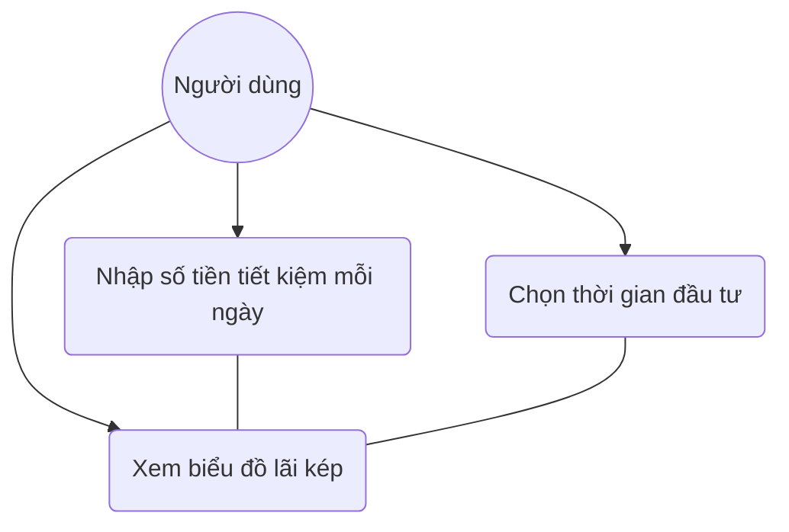

# User Story: Retirement Calculator

**ID**: US-002.001
**Epic**: Smart Tools (EPIC-002)

## 1. Business Logic & Rationale

Gen Z often struggles to see the long-term impact of small daily expenses (like milk tea). This calculator uses the concept of **Compound Interest** to visualize how consistent, small savings can grow into significant wealth over time. This helps shift their perspective from immediate consumption to long-term financial freedom.

## 2. Use Case Diagram

## 3. User Flow

## 4. Functional Requirements (Tasks)

- [ ] **TASK-002.001.001**: Lập công thức tính lãi kép (Ref: BA-EPIC2.US1.T1)
  - **Priority**: Must-have
  - **Dependencies**: None
  - **Description**: Triển khai logic toán học: $A = P \times (1 + r/n)^{nt}$ (hoặc công thức nạp định kỳ).
  - **Acceptance Criteria**:
    - [ ] Phải chính xác tuyệt đối theo toán học.
    - [ ] Xử lý được các tần suất nạp tiền khác nhau (Ngày/Tháng/Năm).

- [ ] **TASK-002.001.002**: Thiết kế biểu đồ tăng trưởng trực quan (Ref: BA-EPIC2.US1.T2)
  - **Priority**: Must-have
  - **Dependencies**: TASK-002.001.001
  - **Description**: Sử dụng Chart.js hoặc thư viện tương đương để vẽ biểu đồ tăng trưởng.
  - **Acceptance Criteria**:
    - [ ] Biểu đồ dạng Đường (Line Chart) hoặc Cột (Bar Chart).
    - [ ] Có hiệu ứng hover để xem số tiền tại từng năm.

- [ ] **TASK-002.001.003**: Code logic nhập liệu và xuất kết quả (Ref: BA-EPIC2.US1.T3)
  - **Priority**: Must-have
  - **Dependencies**: TASK-002.001.002
  - **Description**: Xây dựng UI Form và hiển thị kết quả tổng cuối kỳ.
  - **Acceptance Criteria**:
    - [ ] Kết quả hiển thị số tiền định dạng VND (ví dụ: 1.000.000 đ).
    - [ ] Có nút chia sẻ kết quả "Wow" lên Story.

## 5. Edge Cases & Exceptions

| Scenario | System Behavior | Risk |
| :------- | :-------------- | :--- |
| Nhập lãi suất âm | Hiển thị lỗi "Lãi suất phải lớn hơn 0" | Thấp |
| Số tiền quá lớn (Trứng rồng) | Hệ thống vẫn tính nhưng có thể bị tràn giao diện nếu không giới hạn chữ số | Thấp |

## 6. Audit & Compliance Notes

Kết quả chỉ mang tính minh họa dựa trên lãi suất giả định. Thực tế thị trường có biến động.

## 7. Usability & UX Details

- Thanh trượt (Slider) cho Lãi suất và Số năm để User thay đổi nhanh và thấy biểu đồ nhảy theo (Real-time update).
- Label ví dụ: "1 ly trà sữa (50k)", "1 gói xôi (15k)".

## 8. Form Specifications

### Form: RetirementCalculatorForm

**Purpose**: Input parameters for the compound interest calculation.

| Field # | Field Name | Label | Type | Required | Auto-fill | Format/Validation | Source | Error Message |
|---------|-----------|-------|------|----------|-----------|-------------------|--------|---------------|
| 1 | `daily_saving` | Tiền tiết kiệm mỗi ngày | number | Yes | No | min: 1000, max: 100M | — | "Tối thiểu 1.000đ" |
| 2 | `interest_rate` | Lãi suất kỳ vọng (%/năm) | number | Yes | Yes | min: 1, max: 100 | default: 10 | "Chọn từ 1-100%" |
| 3 | `years` | Thời gian đầu tư (năm) | number | Yes | Yes | min: 1, max: 50 | default: 10 | "Chọn từ 1-50 năm" |
| 4 | `frequency` | Tần suất nạp | select | Yes | Yes | Ngày/Tháng/Quý/Năm | default: Ngày | — |
