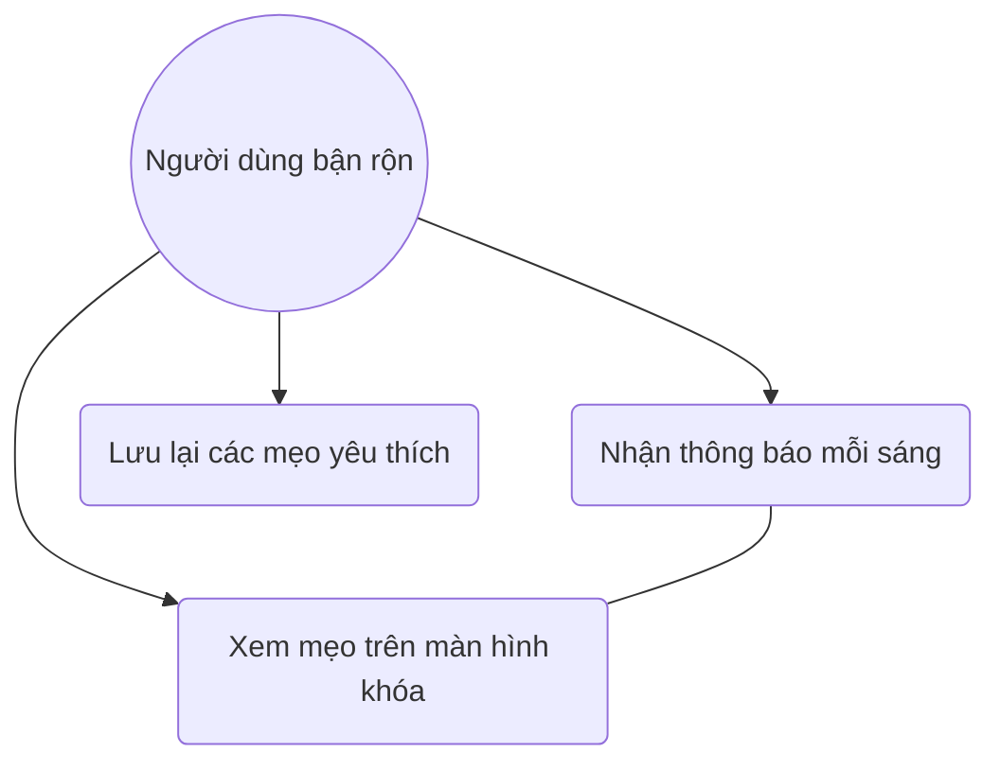
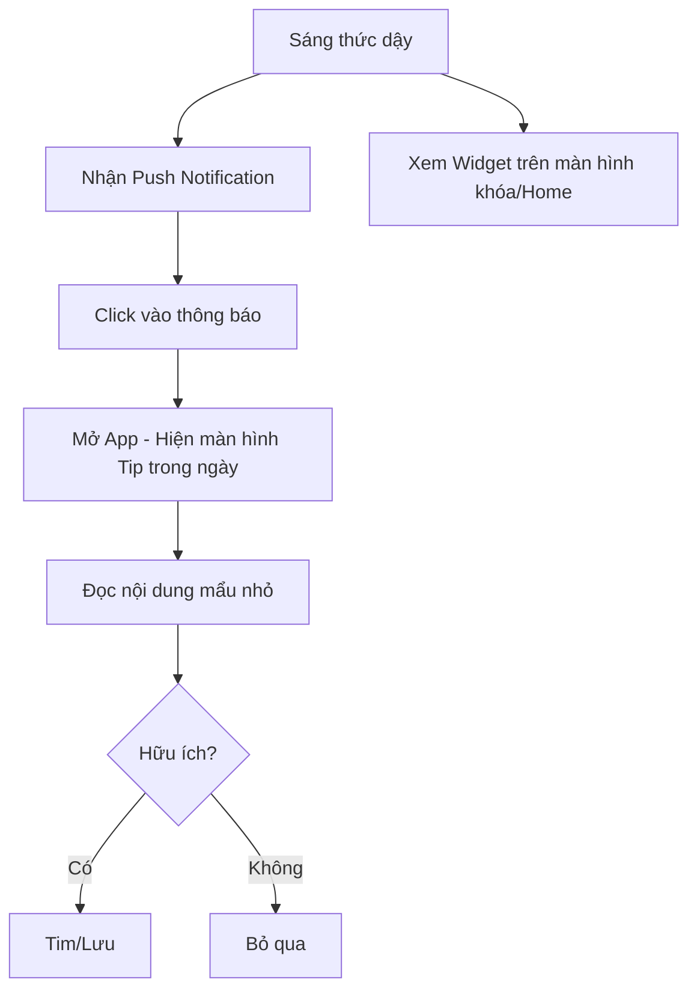

# User Story: Daily Money Tips

**ID**: US-002.002
**Epic**: Smart Tools (EPIC-002)

## 1. Business Logic & Rationale

Consistent exposure to financial wisdom is key to behavioral change. For busy Gen Z users, long articles are often ignored. This feature delivers one small, actionable financial tip every morning ("Micro-learning") to keep finance top-of-mind without requiring significant time investment.

## 2. Use Case Diagram

## 3. User Flow

## 4. Functional Requirements (Tasks)

- [ ] **TASK-002.002.001**: Soạn kho nội dung 365 Daily Tips (Ref: BA-EPIC2.US2.T1)
  - **Priority**: Must-have
  - **Dependencies**: None
  - **Description**: Soạn thảo 365 câu mẹo ngắn (dưới 30 chữ) về Tiết kiệm, Đầu tư, Tâm lý học hành vi.
  - **Acceptance Criteria**:
    - [ ] Nội dung mang tính tích cực, dễ thực hiện.
    - [ ] Phân loại theo category (Học tập/Công cụ/Định hướng).

- [ ] **TASK-002.002.002**: Cấu hình hệ thống Push Notification (Ref: BA-EPIC2.US2.T2)
  - **Priority**: Must-have
  - **Dependencies**: None
  - **Description**: Cài đặt Firebase Cloud Messaging (FCM) hoặc tương đương để gửi thông báo tự động.
  - **Acceptance Criteria**:
    - [ ] Người dùng có thể chọn giờ nhận thông báo (Default: 8:00 AM).
    - [ ] Cho phép bật/tắt nhận thông báo.

- [ ] **TASK-002.002.003**: Thiết kế giao diện Widget trên màn hình khóa (Ref: BA-EPIC2.US2.T3)
  - **Priority**: Should-have
  - **Dependencies**: None
  - **Description**: Tạo widget cho iOS (WidgetKit) và Android để hiển thị tip trực tiếp không cần mở app.
  - **Acceptance Criteria**:
    - [ ] Giao diện tối giản, chữ to rõ.
    - [ ] Tự động cập nhật Tip mới mỗi ngày.

## 5. Edge Cases & Exceptions

| Scenario | System Behavior | Risk |
| :------- | :-------------- | :--- |
| Không có mạng | Widget hiển thị Tip cuối cùng đã cached. | Thấp |
| User ở múi giờ khác | Gửi thông báo theo timezone local của thiết bị. | Trung bình |

## 6. Audit & Compliance Notes

Nội dung tip không được chứa lời khuyên đầu tư cụ thể (VD: "Hãy mua cổ phiếu X").

## 7. Usability & UX Details

- Use beautiful typography.
- Background mỗi ngày là một màu gradient khác nhau tạo cảm giác mới mẻ.
- Nút "Tim" (Like) có effect nổ pháo hoa nhẹ.
