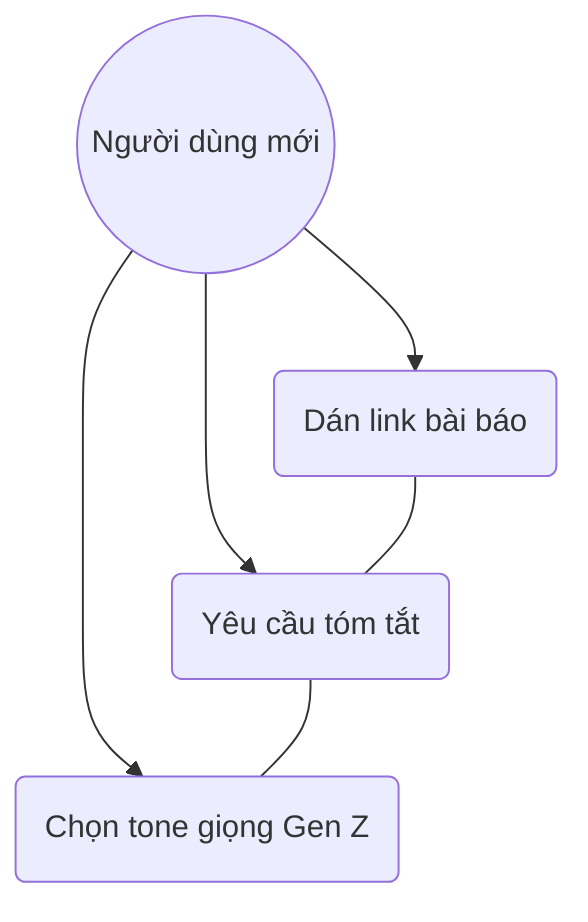
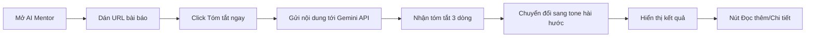

# User Story: Article Summarization

**ID**: US-003.001
**Epic**: AI Mentor (EPIC-003)

## 1. Business Logic & Rationale

Financial news is often filled with jargon that intimidates Gen Z beginners. This "AI Mentor" feature lowers the barrier to entry by using LLMs to distill complex articles into short, relatable, and humorous summaries. This encourages information consumption and builds financial literacy in an entertaining way.

## 2. Use Case Diagram

## 3. User Flow

## 4. Functional Requirements (Tasks)

- [ ] **TASK-003.001.001**: Tích hợp Gemini API để tóm tắt văn bản (Ref: BA-EPIC3.US1.AI)
  - **Priority**: Must-have
  - **Dependencies**: None
  - **Description**: Sử dụng Google Generative AI SDK để gửi nội dung bài báo/link và nhận phản hồi tóm tắt.
  - **Acceptance Criteria**:
    - [ ] Kết quả tóm tắt tối đa 3 dòng (bullet points).
    - [ ] Phải lọc bỏ các nội dung quảng cáo trong bài báo gốc.

- [ ] **TASK-003.001.002**: Prompt Engineering cho tone giọng Gen Z (Ref: BA-EPIC3.US1.AI)
  - **Priority**: Must-have
  - **Dependencies**: TASK-003.001.001
  - **Description**: Xây dựng system prompt để AI sử dụng ngôn ngữ Gen Z (Ví dụ: "Ê, dự án này ổn đấy", "Vụ này căng nha...").
  - **Acceptance Criteria**:
    - [ ] Tích hợp các từ lóng (slang) phổ biến một cách tự nhiên.
    - [ ] Tránh trả lời khô khan theo kiểu Wikipedia.

## 5. Edge Cases & Exceptions

| Scenario | System Behavior | Risk |
| :------- | :-------------- | :--- |
| Link chết hoặc không có quyền truy cập | Hiển thị lỗi "Hổng đọc được link này rồi, thử link khác nha" | Thấp |
| Nội dung quá dài (Vượt token limit) | Tự động cắt bớt phần đầu hoặc thông báo nội dung quá lớn | Trung bình |
| AI bị "ảo giác" (Hallucination) | Hiển thị Disclaimer "Sếp AI chỉ tóm tắt vui, nhớ check kỹ lại nha" | Cao |

## 6. Audit & Compliance Notes

Nội dung do AI tạo ra phải tuân thủ chính sách an toàn, không được đưa lừa đảo hoặc nội dung độc hại.

## 7. Usability & UX Details

- Ô nhập liệu URL to, dễ dán.
- Animation "AI đang vắt óc suy nghĩ..." khi chờ kết quả.
- Cho phép copy nhanh đoạn tóm tắt.

## 8. Form Specifications

### Form: ArticleSummaryForm

| Field # | Field Name | Label | Type | Required | Auto-fill | Format/Validation | Source | Error Message |
|---------|-----------|-------|------|----------|-----------|-------------------|--------|---------------|
| 1 | `article_url` | Link bài báo | url | Yes | No | must start with http/https | — | "Dán link vô đây nè" |
| 2 | `summary_tone` | Tone giọng | select | Yes | Yes | Hài hước/Triết lý/Căng thẳng | default: Hài hước | — |
