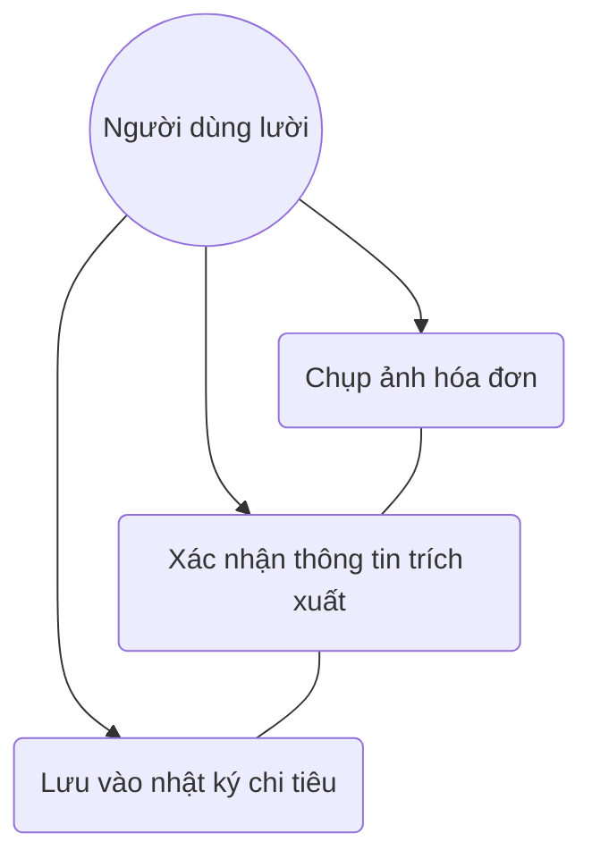
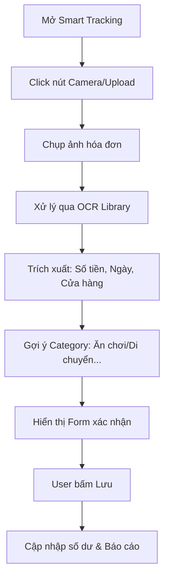

# User Story: Bill OCR Scanning

**ID**: US-004.001
**Epic**: Smart Tracking (EPIC-004)

## 1. Business Logic & Rationale

Manual expense tracking is tedious and often abandoned by users. By allowing users to take a photo of their receipt, the system can automatically extract the amount and suggest a category. This reduces friction, increases data accuracy, and encourages consistent tracking habits among "lazy" users.

## 2. Use Case Diagram

## 3. User Flow

## 4. Functional Requirements (Tasks)

- [ ] **TASK-004.001.001**: Tích hợp thư viện OCR (Tesseract/MLKit) (Ref: BA-EPIC4.US1.T1)
  - **Priority**: Must-have
  - **Dependencies**: None
  - **Description**: Sử dụng thư viện OCR (ví dụ: Tesseract.js cho web hoặc MLKit cho mobile) để quét văn bản từ ảnh.
  - **Acceptance Criteria**:
    - [ ] Trích xuất được các con số (Số tiền) với độ chính xác > 80% trong điều kiện ánh sáng tốt.
    - [ ] Nhận diện được ngày tháng trên hóa đơn.

- [ ] **TASK-004.001.002**: Logic phân loại hạng mục tự động (Ref: BA-EPIC4.US1.T1)
  - **Priority**: Should-have
  - **Dependencies**: TASK-004.001.001
  - **Description**: Dựa trên keywords trích xuất (ví dụ: "The Coffee House" -> "Ăn chơi") để gợi ý category.
  - **Acceptance Criteria**:
    - [ ] Có bộ mapping từ khóa -> category cơ bản.
    - [ ] Cho phép User sửa lại category nếu hệ thống gợi ý sai.

## 5. Edge Cases & Exceptions

| Scenario | System Behavior | Risk |
| :------- | :-------------- | :--- |
| Ảnh quá mờ, không đọc được | Hiển thị thông báo "Ảnh mờ quá sếp ơi, chụp lại nét hơn nha" và mở lại camera. | Trung bình |
| Hóa đơn viết tay | Độ chính xác thấp, chuyển sang chế độ Nhập tay (Manual Entry). | Cao |
| Hóa đơn ngoại tệ | Tạm thời chỉ hỗ trợ VND, cảnh báo nếu thấy ký hiệu tiền tệ lạ. | Thấp |

## 6. Audit & Compliance Notes

Ảnh hóa đơn có thể được lưu trữ làm bằng chứng (Receipt storage) để phục vụ cho việc đối soát hoặc báo cáo thuế cá nhân sau này.

## 7. Usability & UX Details

- Camera UI có khung căn chỉnh giúp User chụp đúng vị trí.
- Hiển thị haptic feedback khi trích xuất thành công.

## 8. Form Specifications

### Form: ConfirmOcrExpenseForm

| Field # | Field Name | Label | Type | Required | Auto-fill | Format/Validation | Source | Error Message |
|---------|-----------|-------|------|----------|-----------|-------------------|--------|---------------|
| 1 | `amount` | Số tiền | number | Yes | Yes | min: 0 | OCR Output | "Nhập số tiền" |
| 2 | `category` | Hạng mục | select | Yes | Yes | List of categories | Keyword Match | "Chọn hạng mục" |
| 3 | `date` | Ngày hóa đơn | date | Yes | Yes | Valid date | OCR Output | "Chọn ngày" |
| 4 | `note` | Ghi chú | text | No | Yes | Store name | OCR Output | — |
