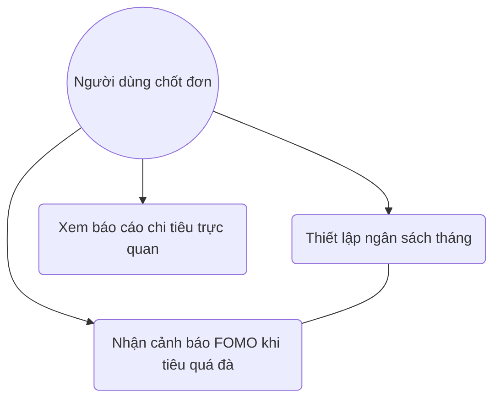

# User Story: FOMO Spending Alerts

**ID**: US-004.002
**Epic**: Smart Tracking (EPIC-004)

## 1. Business Logic & Rationale

Gen Z is highly susceptible to FOMO (Fear Of Missing Out) spending, especially on trends and "aesthetic" purchases. This feature acts as a "financial conscience" by monitoring spending in discretionary categories (e.g., Shopping, Milk tea) relative to the user's defined budget. When a threshold is reached, it uses Gen Z-style notifications to playfully but firmly warn the user, helping them regain control over their impulses.

## 2. Use Case Diagram



## 3. User Flow

```mermaid
%% accTitle: User Flow for US-004.002
flowchart TD
    A[Ghi nhận chi tiêu mới] --> B{Vượt 30% ngân quỹ?}
    B -- Rồi --> C[Trigger FOMO Alert]
    B -- Chưa --> D[Lưu bình thường]
    C --> E[AI chọn nội dung cảnh báo xéo sắc]
    E --> F[Gửi Push Notification/Popup]
    F --> G{User vẫn muốn mua?}
    G -- Vẫn mua --> H[Ghi nhận & Cập nhật Warning Level cấp độ cao hơn]
    G -- Dừng lại --> I[Tặng Huy hiệu "Kìm chế giỏi"]
```

## 4. Functional Requirements (Tasks)

- [ ] **TASK-004.002.001**: Logic kiểm tra ngưỡng ngân sách (Ref: BA-EPIC4.US2.Code)
  - **Priority**: Must-have
  - **Dependencies**: None
  - **Description**: Triển khai logic code so sánh tổng chi tiêu category hiện tại với Budget đã set.
  - **Acceptance Criteria**:
    - [ ] Trigger alert ngay khi chi tiêu thực tế >= 30% (Warning 1) và >= 80% (Warning 2) ngân sách.
    - [ ] Phải hỗ trợ các chu kỳ ngân sách (Tháng/Tuần).

- [ ] **TASK-004.002.002**: AI tạo nội dung cảnh báo "xéo sắc" (Ref: BA-EPIC4.US2.AI)
  - **Priority**: Should-have
  - **Dependencies**: TASK-004.002.001
  - **Description**: Sử dụng AI (hoặc Template Engine) để tạo lời nhắn cảnh báo đậm chất Gen Z.
  - **Acceptance Criteria**:
    - [ ] Lời nhắn phải hài hước, mang tính nhắc nhở thay vì giáo điều.
    - [ ] Ví dụ: "Ê, dừng lại! Bạn đã dùng hết quỹ trà sữa của tháng này rồi đấy!".

## 5. Edge Cases & Exceptions

| Scenario | System Behavior | Risk |
| :------- | :-------------- | :--- |
| User chưa thiết lập ngân sách | Hệ thống sử dụng quy tắc 50/30/20 mặc định hoặc không hiện cảnh báo. | Thấp |
| Chi tiêu lặp lại (Subcription) | Không hiện cảnh báo cho các khoản cố định (Netflix, Spotify). | Trung bình |

## 6. Audit & Compliance Notes

Cảnh báo mang tính chất nhắc nhở hành vi, không chặn giao dịch của người dùng.

## 7. Usability & UX Details

- Màu sắc cảnh báo đậm (Neon Red/Orange).
- Sử dụng Memes hoặc Sticker vui nhộn trong thông báo.
- Nút "Tôi biết lỗi rồi" để tắt popup.
