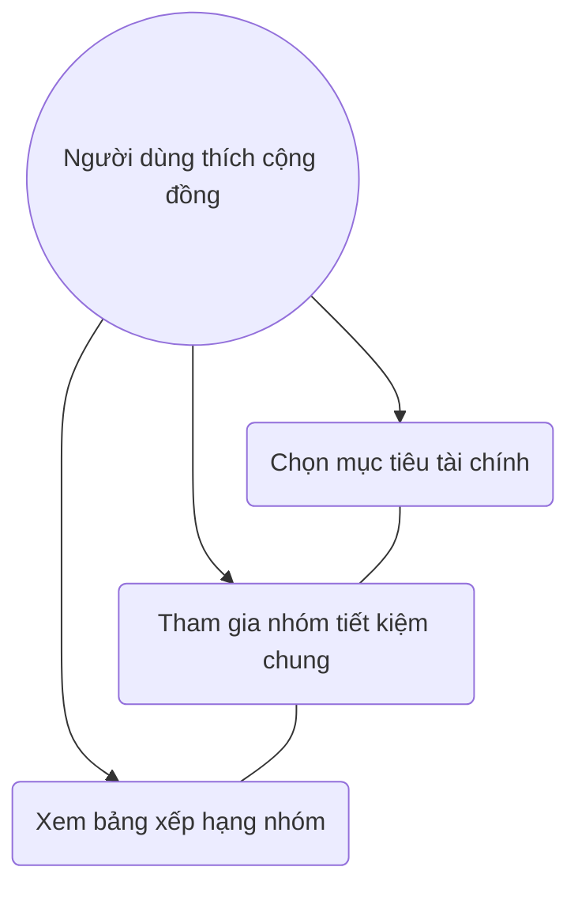
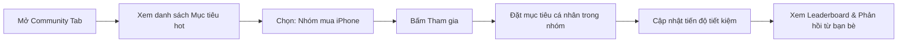

# User Story: Goal-based Community Groups

**ID**: US-005.001
**Epic**: Gamification (EPIC-005)

## 1. Business Logic & Rationale

Saving alone can be boring and difficult to sustain. Gen Z thrives in digital communities. This feature creates "Social Saving" groups where users with the same financial goals (e.g., "Saving for iPhone 16", "Trip to Dalat") can track progress together, share tips, and encourage each other. Peer support and healthy competition significantly increase the likelihood of achieving financial goals.

## 2. Use Case Diagram

## 3. User Flow

## 4. Functional Requirements (Tasks)

- [ ] **TASK-005.001.001**: Xây dựng danh sách nhóm theo mục tiêu (Ref: BA-EPIC5.US2.T1)
  - **Priority**: Must-have
  - **Dependencies**: None
  - **Description**: Tạo hệ thống các nhóm (Squads) dựa trên Tags mục tiêu có sẵn (iPhone, Laptop, Du lịch...).
  - **Acceptance Criteria**:
    - [ ] Hiển thị số lượng thành viên đang tham gia nhóm.
    - [ ] Hiển thị tiến độ tổng của cả nhóm (Collective Goal).

- [ ] **TASK-005.001.002**: Tính năng Cập nhật tiến độ & Leaderboard (Ref: BA-EPIC5.US2.T1)
  - **Priority**: Must-have
  - **Dependencies**: TASK-005.001.001
  - **Description**: Cho phép User log số tiền đã tiết kiệm được cho mục tiêu đó và xếp hạng.
  - **Acceptance Criteria**:
    - [ ] Bảng xếp hạng dựa trên % hoàn thành thay vì số tiền tuyệt đổi (để đảm bảo công bằng).
    - [ ] Có nút "Gửi lời chúc" hoặc "Tiếp sức" cho bạn bè trong nhóm.

## 5. Edge Cases & Exceptions

| Scenario | System Behavior | Risk |
| :------- | :-------------- | :--- |
| Nhóm quá đông người | Tự động tách thành các Sub-groups (nhóm nhỏ) từ 10-20 người để tăng tương tác. | Trung bình |
| User rời nhóm giữa chừng | Xóa tiến độ khỏi nhóm đó nhưng giữ lại ví tiết kiệm cá nhân. | Thấp |

## 6. Audit & Compliance Notes

Nghiêm cấm hành vi kêu gọi góp vốn hoặc đa cấp trong các nhóm cộng đồng. Chỉ là nơi theo dõi tiến độ cá nhân trong môi trường chung.

## 7. Usability & UX Details

- Giao diện trẻ trung, sử dụng nhiều avatars và stickers.
- Thông báo: "X đã hoàn thành 50% mục tiêu, vào chúc mừng bạn ấy nào!".

## 8. Form Specifications

### Form: JoinGoalGroupForm

| Field # | Field Name | Label | Type | Required | Auto-fill | Format/Validation | Source | Error Message |
|---------|-----------|-------|------|----------|-----------|-------------------|--------|---------------|
| 1 | `group_tag` | Mục tiêu | select | Yes | No | iPhone/Laptop/Travel | — | "Chọn mục tiêu" |
| 2 | `personal_target` | Số tiền cần đạt | number | Yes | No | min: 100k | — | "Tối thiểu 100.000đ" |
| 3 | `target_date` | Ngày mong muốn đạt được | date | Yes | No | must be in future | — | "Chọn ngày trong tương lai" |
