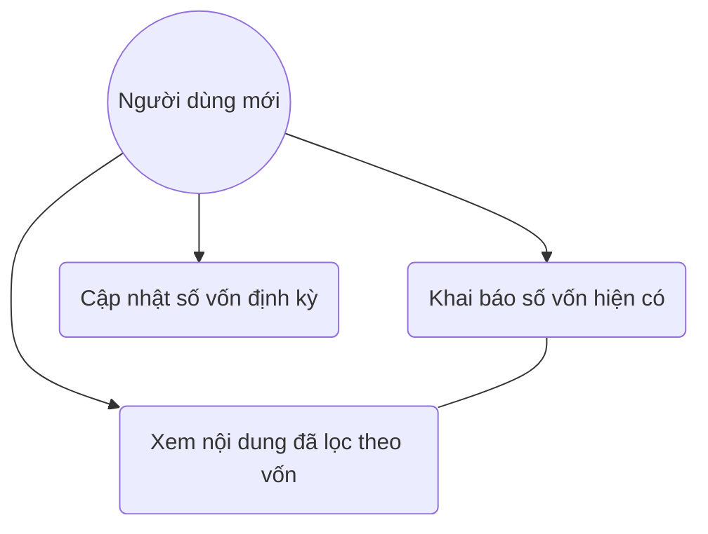

# User Story: Content Filtering by Capital

**ID**: US-006.001
**Epic**: Financial Roadmap (EPIC-006)

## 1. Business Logic & Rationale

Different investment strategies require different levels of initial capital. Suggesting high-capital investments (e.g., real estate or large stock portfolios) to a student with 0 VND is discouraging. This feature uses an onboarding survey to understand the user's available capital and uses system tags to filter the Academy content, ensuring every user sees a roadmap that is achievable for their current situation.

## 2. Use Case Diagram



## 3. User Flow

```mermaid
%% accTitle: User Flow for US-006.001
flowchart TD
    A[Bắt đầu Onboarding] --> B[Khảo sát ngắn: Bạn có bao nhiêu vốn?]
    B --> C[Lựa chọn: 0đ / 1tr / 10tr / >50tr]
    C --> D[Hệ thống gán Tag: CAPITAL_LEVEL]
    D --> E[Lọc API Dashboard]
    E --> F[Hiển thị Home: Chỉ hiện bài học phù hợp]
    F --> G[Mục "Dành riêng cho bạn"]
```

## 4. Functional Requirements (Tasks)

- [ ] **TASK-006.001.001**: Thiết kế khảo sát Onboarding cực ngắn gọn (Ref: BA-EPIC6.US1.Task)
  - **Priority**: Must-have
  - **Dependencies**: None
  - **Description**: Xây dựng UI khảo sát đầu vào (1-2 câu hỏi) để phân loại người dùng ngay khi cài app.
  - **Acceptance Criteria**:
    - [ ] Không tốn quá 30 giây để hoàn thành.
    - [ ] Giao diện dạng Swipe hoặc Big Buttons.

- [ ] **TASK-006.001.002**: AI/System phân loại nội dung dựa trên Tags (Ref: BA-EPIC6.US1.AI)
  - **Priority**: Must-have
  - **Dependencies**: TASK-006.001.001
  - **Description**: Gắn tags (Vốn/Kỹ năng/Thời gian) cho mọi bài viết. Logic lọc nội dung dựa trên `CAPITAL_LEVEL` của user.
  - **Acceptance Criteria**:
    - [ ] Nếu User chọn vốn 0đ, các bài về Stock/Vàng sẽ bị ẩn hoặc hiện cảnh báo "Cần tích lũy thêm".
    - [ ] Ưu tiên hiện bài Affiliate/Làm thêm cho vốn 0đ.

## 5. Edge Cases & Exceptions

| Scenario | System Behavior | Risk |
| :------- | :-------------- | :--- |
| User không muốn khai báo | Cho phép bỏ qua (Skip) và hiện nội dung mặc định (All content). | Thấp |
| Vốn thay đổi theo thời gian | Cho phép User cập nhật lại trong Profile. | Thấp |

## 6. Audit & Compliance Notes

Việc khai báo vốn chỉ mang tính chất lọc nội dung, không yêu cầu xác minh số dư thực tế tại ngân hàng (Privacy focus).

## 7. Usability & UX Details

- Sử dụng icon vui nhộn: 0đ (Hạt dẻ), <10tr (Heo đất), >50tr (Túi tiền).
- Thông điệp: "Ví bạn đang ở đâu, lộ trình bắt đầu từ đó".

## 8. Form Specifications

### Form: OnboardingCapitalForm

| Field # | Field Name | Label | Type | Required | Auto-fill | Format/Validation | Source | Error Message |
|---------|-----------|-------|------|----------|-----------|-------------------|--------|---------------|
| 1 | `capital_range` | Số vốn bạn đang có | radio | Yes | No | 0 / <1tr / <10tr / >10tr | — | "Chọn một mốc nhé" |
| 2 | `primary_goal` | Mục tiêu chính | select | No | No | Kiếm tiền/Tiết kiệm/Đầu tư | — | — |
