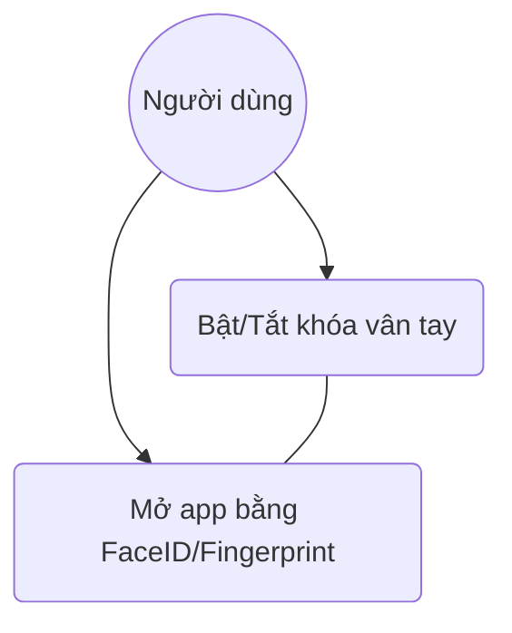
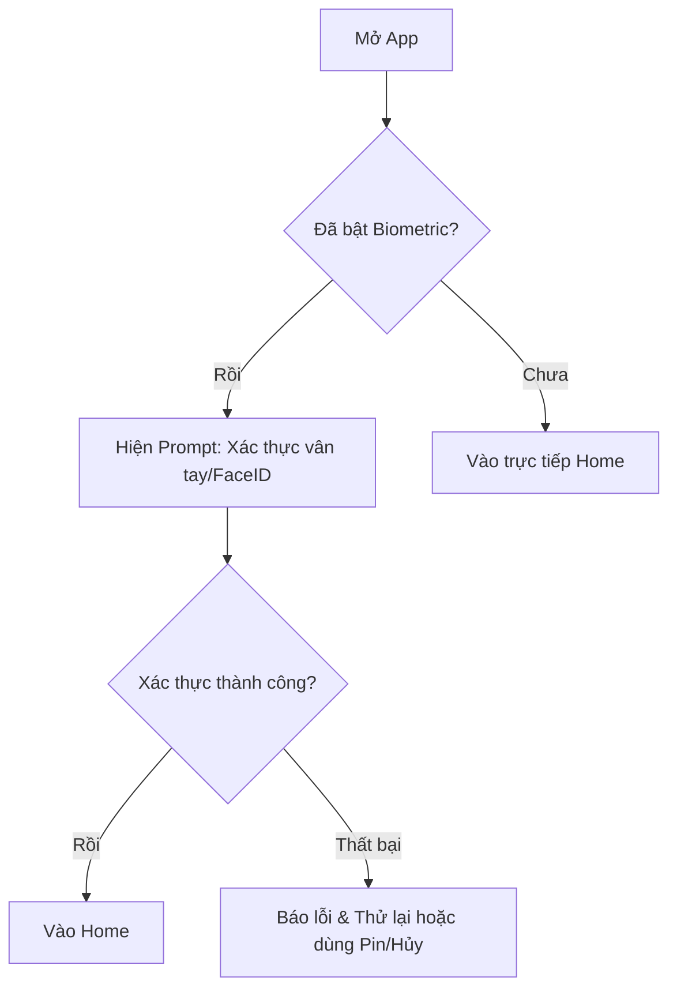

# User Story: Biometric App Lock

**ID**: US-006.002
**Epic**: Financial Roadmap (EPIC-006)

## 1. Business Logic & Rationale

Financial data is extremely sensitive. Users want to ensure that even if they lend their phone to a friend or family member, their spending habits, savings progress, and balance remain private. Implementing Biometric authentication (FaceID/Fingerprint) provides a seamless yet highly secure layer of protection that Gen Z users expect from any financial application.

## 2. Use Case Diagram

## 3. User Flow

## 4. Functional Requirements (Tasks)

- [ ] **TASK-006.002.001**: Tích hợp Local Auth (Biometric) (Ref: BA-EPIC6.US2.Task)
  - **Priority**: Must-have
  - **Dependencies**: None
  - **Description**: Sử dụng thư viện `local_auth` (Flutter) hoặc `FingerprintManager` (Android) / `LAContext` (iOS) để gọi xác thực hệ thống.
  - **Acceptance Criteria**:
    - [ ] Tự động nhận diện loại sinh trắc học thiết bị hỗ trợ (FaceID hoặc TouchID).
    - [ ] Phải có fallback sang mã PIN nếu sinh trắc học hỏng/không khả dụng.

## 5. Edge Cases & Exceptions

| Scenario | System Behavior | Risk |
| :------- | :-------------- | :--- |
| Thiết bị không hỗ trợ sinh trắc học | Ẩn option "FaceID/Vân tay" trong Settings. | Thấp |
| Xác thực sai quá nhiều lần | Khóa sinh trắc học tạm thời (System lock), yêu cầu nhập mật khẩu cấp 2. | Trung bình |

## 6. Audit & Compliance Notes

Dữ liệu sinh trắc học được xử lý bởi HĐH, App không lưu trữ mẫu vân tay/khuôn mặt của User (Security standards).

## 7. Usability & UX Details

- Toggle switch trong Settings cực nhạy.
- Hiển thị Icon Lock/Unlock chuyên nghiệp.
