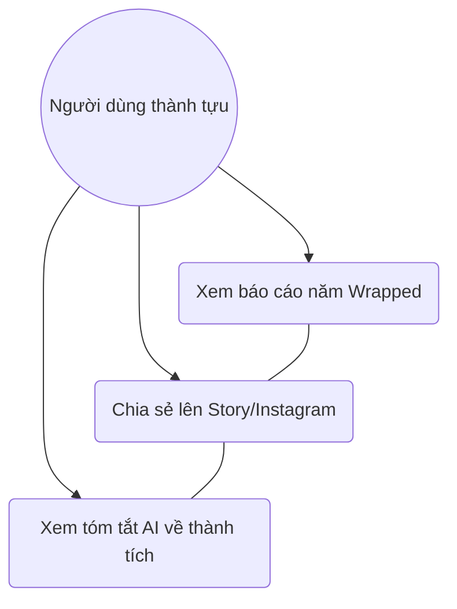

# User Story: Annual Financial Wrapped

**ID**: US-006.003
**Epic**: Financial Roadmap (EPIC-006)

## 1. Business Logic & Rationale

Emotional engagement is critical for long-term retention. Inspired by "Spotify Wrapped," this features provides a visually stunning, shareable summary of the user's year in finance. By highlighting positive achievements (e.g., "You saved 20 milk teas this month!"), it creates a "feel-good" moment that users want to share on social media, acting as free organic marketing for the app.

## 2. Use Case Diagram



## 3. User Flow

```mermaid
%% accTitle: User Flow for US-006.003
flowchart TD
    A[Màn hình Home] --> B[Banner: Xem lại năm 202X của bạn]
    B --> C[Click Xem ngay]
    C --> D[Giao diện chạy dạng Story (Slides)]
    D --> E[Slide 1: Tổng số tiền tiết kiệm]
    E --> F[Slide 2: Hạng mục chi nhiều nhất]
    F --> G[Slide 3: Bài học Academy tâm đắc nhất]
    G --> H[Slide 4: Huy hiệu & Cấp độ đạt được]
    H --> I[Nút Chia sẻ Instagram/Facebook]
```

## 4. Functional Requirements (Tasks)

- [ ] **TASK-006.003.001**: Thiết kế giao diện báo cáo dạng Story (Ref: BA-EPIC6.US3.Task)
  - **Priority**: Must-have
  - **Dependencies**: None
  - **Description**: Xây dựng UI Component dạng slide tự chạy, có nhạc nền và hiệu ứng particle.
  - **Acceptance Criteria**:
    - [ ] Hiển thị mượt mà các con số tăng dần (Counter animation).
    - [ ] Tương thích hoàn hảo với tỷ lệ màn hình Story (9:16).

- [ ] **TASK-006.003.002**: AI tóm tắt thành tựu (Ref: BA-EPIC6.US3.AI)
  - **Priority**: Should-have
  - **Dependencies**: None
  - **Description**: AI phân tích data và tạo câu Quote khen ngợi: "Bạn là Chiến thần tiết kiệm trà sữa của năm!".
  - **Acceptance Criteria**:
    - [ ] Câu Quote phải ngắn gọn, phù hợp để chèn vào ảnh.

## 5. Edge Cases & Exceptions

| Scenario | System Behavior | Risk |
| :------- | :-------------- | :--- |
| User mới dùng app 1 ngày | Không hiện Wrapped hoặc hiện "Wrapped Mini" (Chào mừng bạn mới). | Thấp |
| Lỗi mạng khi render ảnh chia sẻ | Cho phép tải lại hoặc chia sẻ dạng link thay vì ảnh. | Trung bình |

## 6. Audit & Compliance Notes

Không hiển thị số dư tuyệt đối trên ảnh chia sẻ công khai (để bảo vệ quyền riêng tư và an toàn cho user), chỉ hiển thị số tiền tiết kiệm được hoặc %.

## 7. Usability & UX Details

- Vibrant colors, gradients.
- Nút "Share now" nổi bật ở slide cuối cùng.
- Nhạc nền sôi động.
